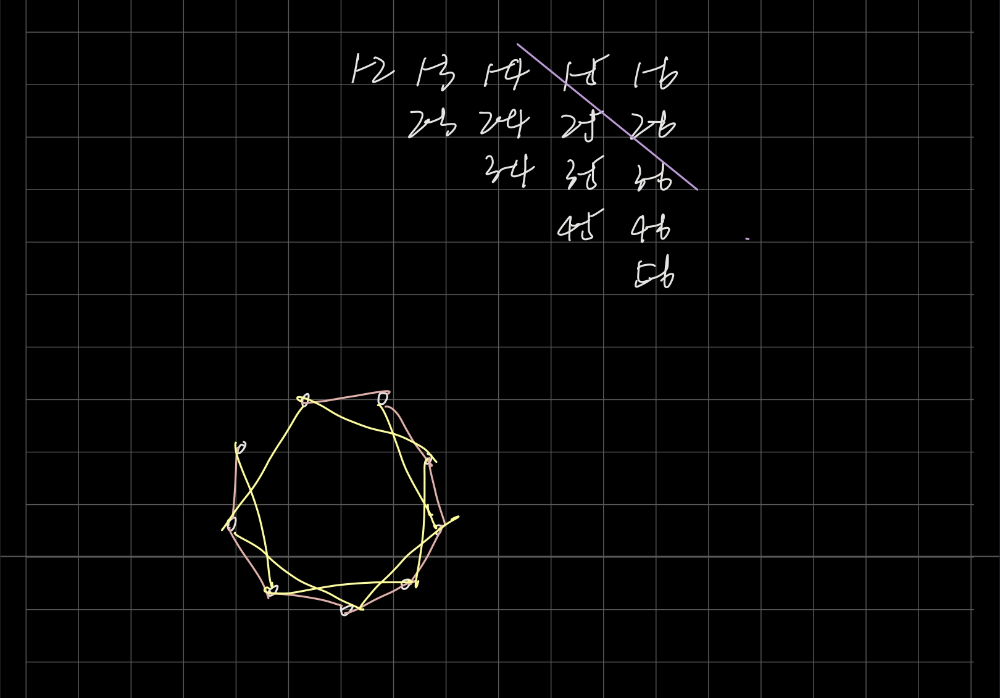
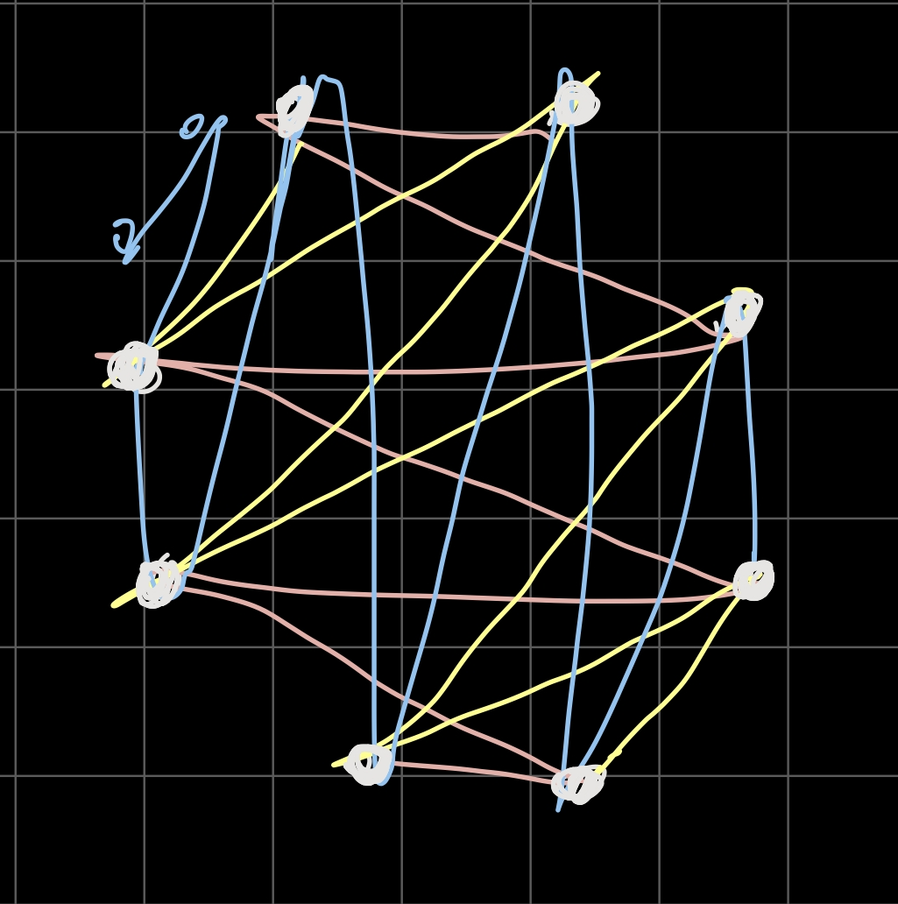
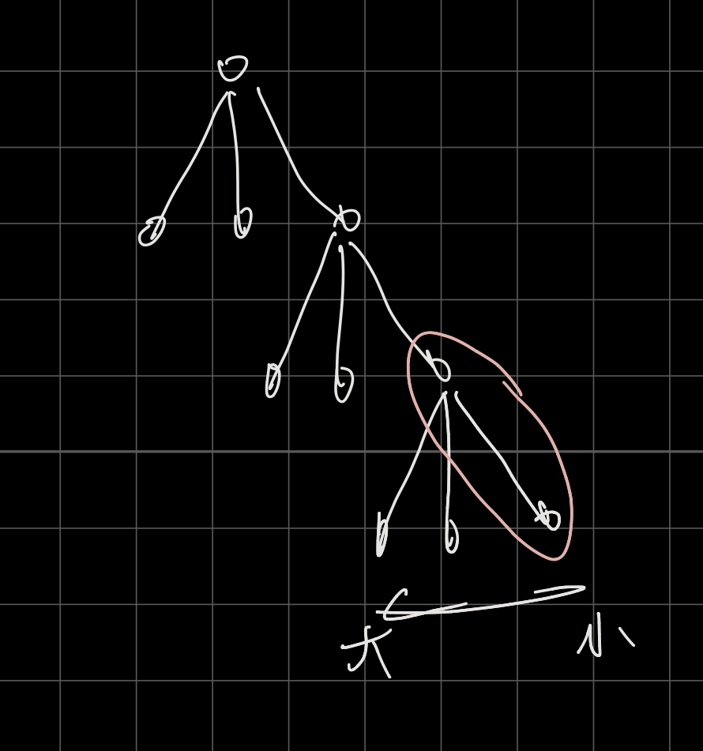

# 2019ICPC上海 （The 2019 ICPC Asia Shanghai Regional Contest

## AC 5/13  目标：-

**赛后补题目标** ：

F - A Simple Problem On A Tree

---

### TLE : 

**E - Cave Escape** ： 他卡快排，由于答案不超过10000，可以计数排序

### WA ：

**D - Spanning Tree Removal** ： 构造方式刚开始错了，

---

~~全场图论~~

题解视频在B站 [ICPC 2019 上海赛区颁奖典礼](https://www.bilibili.com/video/BV13J41197ZZ?t=509)

构造题，题解构造方式方法还是要注意一下，思路

---

## 需学习的知识点：

**树链剖分** （ F - A Simple Problem On A Tree

----

# ~

##B - Prefix Code

**题意** ：给出一个数字集合，保证每个数字长度小于10，判断是否存在一个数字是其他数字的前缀，不存在这样的情况则`yes`

题目只有第一段是有效的，读题真的会懵掉（？），其实不难，排个序然后判断下前面是否为后面的前缀就成，

刚开始还在想什么tire树，真实把简单问题复杂化

```cpp
#include <bits/stdc++.h>
using namespace std;
typedef long long ll;
const ll N=1000005;
const ll inf=0x3f3f3f3f3f3f3f3f;

string a[N];

int main(){
    ios::sync_with_stdio(0);
    int t;
    cin>>t;
    int num=0;
    while(t--){
        num++;
        int n;
        cin>>n;
        for(int i=1;i<=n;i++) cin>>a[i];
        sort(a+1,a+1+n);
        bool f=0;
        for(int i=2;i<=n;i++){
            if(a[i].find(a[i-1])!=string::npos){
                f=1;
                break;
            }
        }
        cout<<"Case #"<<num<<": ";
        if(f) cout<<"No"<<endl;
        else cout<<"Yes"<<endl;
    }
}

```

---

##K - Color Graph

**题意** ：给一个图，不带自环，节点数$N \le 16$，可以将一些边染色，但不能出现全部染色的奇数环，问最多能染多少边

刚开始看错题目了，以为染点

可以枚举节点集合构造二分图，连接两个集合的边就是可以染色的边，对每种情况更新答案

```cpp
#include <bits/stdc++.h>
using namespace std;
typedef long long ll;
const ll N=1000005;
const ll inf=0x3f3f3f3f3f3f3f3f;

bool g[20][20];

int main(){
    ios::sync_with_stdio(0);
    int t;
    cin>>t;
    for(int Case=1;Case<=t;Case++){
        int n,m;
        cin>>n>>m;
        memset(g,0,sizeof g);
        for(int i=1;i<=m;i++){
            int a,b;
            cin>>a>>b;
            a--;
            b--;
            g[a][b]=g[b][a]=1;
        }
        int ans=0;
        for(int s=0;s<(1<<n);s++){
            int cnt=0;
            for(int i=0;i<n;i++){
                for(int j=i+1;j<n;j++){
                    if(g[i][j]&&(((s&(1<<i))&&!(s&(1<<j)))||(!(s&(1<<i))&&(s&(1<<j))))) cnt++;
                }
            }
            ans=max(ans,cnt);
        }
        cout<<"Case #"<<Case<<": "<<ans<<endl;
    }
}

```

---

## E - Cave Escape

**题意** ：给一个$n \times m$的矩阵的迷宫，每个格子有一个权值，（$V_{ij} \ge 0$），可以向上下左右移动，每次如果将要去的格子没有到达过，则可以获得$V_{当前格子} \times V_{将要去的格子}$的价值，给出起点终点，（到达终点也可以不出去），问可以获得的最大的权值

对于每次移动建边，就是求最大生成树

到终点可以不出去，相当于与终点没有关系（?

卡常卡的，

==需要排序的权值很小，不超过10000，可以用计数排序，sort快排会爆==

```cpp
#include <bits/stdc++.h>
using namespace std;
typedef long long ll;
const int N=2000005;

int pa[N],n,m;
int sx,sy,ex,ey;
int g[1005][1005];

inline int encode(int &a,int &b){
    return (a-1)*m+b-1;
}

int dir[][2]={1,0,0,1};

struct edge{
    int from,to,val;
    edge(){}
    edge(int a,int b,int c):from(a),to(b),val(c){}
};

inline bool cmp(edge &a,edge &b){
    return a.val>b.val;
}

inline int find(int a){
    return pa[a]==a?a:pa[a]=find(pa[a]);
}

inline void merge(int a,int b){
    pa[find(a)]=find(b);
}

vector<pair<int,int> > sta[N];

int main(){
    ios::sync_with_stdio(0);
    int t;
    cin>>t;
    for(int Case=1;Case<=t;Case++){
        cin>>n>>m>>sx>>sy>>ex>>ey;
        int x1,x2,a,b,c,p;
        cin>>x1>>x2>>b>>a>>c>>p;
        int cnt=0;
        for(int i=1;i<=n;i++){
            for(int j=1;j<=m;j++){
                cnt++;
                if(cnt==1) g[i][j]=x1;
                else if(cnt==2) g[i][j]=x2;
                else {
                    g[i][j]=(a*x1+b*x2+c)%p;
                    x1=x2;
                    x2=g[i][j];
                }
            }
            
        }
        for(int i=0;i<=10000;i++) sta[i].clear();
        for(int i=1;i<=n;i++){
            for(int j=1;j<=m;j++){
                if(g[i][j]==0) continue;
                for(int k=0;k<2;k++){
                    int x=i+dir[k][0];
                    int y=j+dir[k][1];
                    if(x<=n&&y<=m){
                        sta[g[i][j]*g[x][y]].push_back(pair<int,int>(encode(i,j),encode(x,y)));
                    }
                }
            }
        }
        for(int i=0;i<=n*m;i++) pa[i]=i;
        ll ans=0;
        for(int i=10000;i>=0;i--){
            for(auto x:sta[i]){
                if(find(x.first)==find(x.second)) continue;
                ans+=i;
                merge(x.first,x.second);
            }
        }
        cout<<"Case #"<<Case<<": "<<ans<<endl;
    }
}

```

---

##D - Spanning Tree Removal

**题意** : 给出n个点的完全图，每次需要移除一个包含n个点的生成树的所有边，问最多能移除多少次，输出每次移除的树

构造，能移除多少次的结论出的挺快的 : $\frac{n}{2}$

刚开始的想法是



紫色斜线下方的数字先连上，再通过统筹斜线上的边将前后连起来，

还有个想法是间隔几个去连一条边，但是要注意不能成环，于是又猜是不是可以`%（n + 1）`将后面再换到另一个环内，（？

~~简直乱猜~~

每个数都作为一次头一次尾

从1开始每次+i % (n + 1)（$i \in [1,n - 1]$）, 但是如果有前一段的和恰好是n+1的倍数就会出现重复

然后说可以把中间偶数的前后顺序换一下（？也不会证明就是不知道为啥可以

官方题解找一个点先向左一步再向右两步再向左三步$\dots$

递归构造，每次加两个点，（例如蓝线

然后换个起点，很妙



```cpp
#include<bits/stdc++.h>
using namespace std;
typedef long long ll;

int a[1005];
int main(){
    #ifdef ONLINE_JUDGE
    #else
        //freopen("in.txt","r",stdin);
        //freopen("out.txt","w",stdout);
    #endif
    int n,nn;
    scanf("%d",&nn);
    for(int cas=1;cas<=nn;cas++){
        scanf("%d",&n);
        int p=n/2*2-1;
        printf("Case #%d: %d\n",cas,n/2);
        for(int i=1;i<=p;i++){
            if(i&1)a[i]=i;
            else a[i]=p-i+1;
        }
        for(int i=1;i<=n/2;i++){
            if(n&1){
                printf("%d %d\n",n,i);
            }
            int lx=i,x=i;
            for(int j=1;j<=p;j++){
                x=(x+a[j])%(p+1);
                if(x==0)x=p+1;
                printf("%d %d\n",lx,x);
                lx=x;
            }
        }
    }
    return 0;
}
```

---

##H - Tree Partition

二分答案，

每次贪心看节点的儿子，权值从小到大能不能放进去，



```cpp
#include <bits/stdc++.h>
using namespace std;
typedef long long ll;
const ll N=1000005;
const ll inf=0x3f3f3f3f3f3f3f3f;

vector<ll> g[N];
ll val[N];
ll n,k,ans;
ll dp[N],mid;

bool cal(ll u,ll fa){
    dp[u]=val[u];
    if(dp[u]>mid) return 0;
    for(auto x:g[u]){
        if(x==fa) continue;
        if(!cal(x,u)) return 0;
    }
    vector<ll> v;
    for(auto x:g[u]){
        if(x==fa) continue;
        v.push_back(dp[x]);
    }
    sort(v.begin(),v.end());
    int p=0;
    while(p<v.size()&&dp[u]+v[p]<=mid){
        dp[u]+=v[p++];
    }
    ans+=(int)v.size()-p;
    return 1;
}

bool check(){
    ans=0;
    if(!cal(1,-1)) return 0;
    return ans<k;
}

int main(){
    ios::sync_with_stdio(0);
    ll t;
    cin>>t;
    for(ll Case=1;Case<=t;Case++){
        cin>>n>>k;
        for(int i=1;i<=n;i++) g[i].clear();
        for(ll i=1;i<n;i++){
            ll a,b;
            cin>>a>>b;
            g[a].push_back(b);
            g[b].push_back(a);
        }
        for(ll i=1;i<=n;i++) cin>>val[i];
        ll l=1,r=1e18;
        while(l<r){
            mid=(l+r)>>1;
            if(check()){
                r=mid;
            }else {
                l=mid+1;
            }
        }
        cout<<"Case #"<<Case<<": "<<l<<endl;
    }
}

```

---
