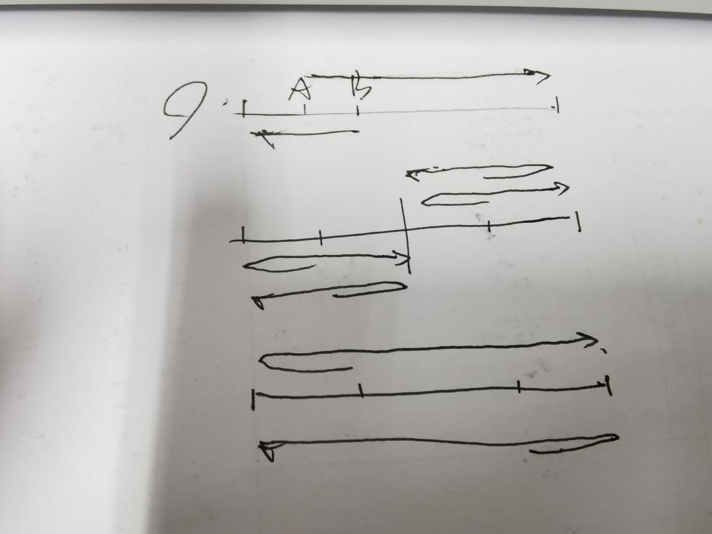

# 2020 ICPC 上海

## AC 5/13  目标：6/13 （银

[传送门](https://ac.nowcoder.com/acm/contest/9925)

**赛后补题目标** ：

**C - Sum of Log**（待

---

### TLE

D：漏了一种情况导致二分死循环

### WA：

D：漏了一种情况，因为刚开始的做法是浮点数二分，以为是精度问题，冲了好多发，后来换了方法还是漏了情况

M：将字符串作为节点，分界字符出了一点问题，漏了一个判断

I：转移的时候推错了

C：

---

这场感觉相对比较偏思维（？

这场的罚时有点大，略可惜

> 分类一道题比如已经想出了六种情况，然后wa了，那么是自己已有的情况推错了还是漏情况了？

> 两种写法对拍都一样，那一定是思路的问题

但是比赛到后面真的脑子会晕掉，分类分不明白..

---

## 需学习的知识点：

数位dp再加强下（？

----

# ~

## G

水

```cpp
#include<bits/stdc++.h>
using namespace std;
typedef long long ll;
int main(){
    ios::sync_with_stdio(0);
    ll n;
    cin>>n;
    ll x=(n/3*2+n%3);
    cout<<(n*n-n)/2-(x*x-x)/2<<endl;
}
```

---

## D - Walker

**题意** ： 两个人在一条线段上面走，给出线段的总长度和两个人的位置和两个人的速度，问把整个线段都走一遍的最少时间

刚开始的想法是认为可以找到一个中点，左边都是左边的人走的，右边都是右边的人走的，二分中点，特判整条路都是同一个人走的

中间t了以为是浮点数二分的精度问题，于是又冲（（

后来换了个想法用$O(1)$的方法分类直接算

也是找中点

漏了两个人相向而行的情况，



分类

```cpp
#include<bits/stdc++.h>

using namespace std;
const double eps = 1e-12;

inline double cal(const double &l, const double &x, const double &v) {
    return (min(x, l - x) + l) / v;
}

double n, p1, v1, p2, v2;

double ab() {
    return (2 * n * v1 - p2 * v1 - p1 * v2) / (v1 + v2);
}

double ba() {
    return (v1 * p2 + n * v1 + p1 * v2) / (2 * v1 + 2 * v2);
}

double bb() {
    return (p1 * v2 + 2 * n * v1 - p2 * v1) / (2 * v2 + v1);
}

double aa() {
    return (p2 * v1 + n * v1 - p1 * v2) / (v2 + 2 * v1);
}

int main() {
    ios::sync_with_stdio(0);
    int t;
    cin >> t;
    while (t--) {
        cin >> n >> p1 >> v1 >> p2 >> v2;
        if (p1 > p2) {
            swap(p1, p2);
            swap(v1, v2);
        }
        double ans = min(cal(n, p1, v1), cal(n, p2, v2));
        ans = min(ans, max((n - p1) / v1, p2 / v2));
        ans = min(ans, max(cal(p1, p1, v1), cal(n - p1, p2 - p1, v2)));
        ans = min(ans, max(cal(p2, p1, v1), cal(n - p2, 0, v2)));
        double zuo = p1 * 2;
        double you = p2 - (n - p2);
        if (zuo < you) {
            double x;
            x = ab();
            if (zuo < x + eps && x < you + eps && p1 < x + eps && x < p2 + eps) ans = min(ans, cal(x, p1, v1));
            x = bb();
            if (p1 < x + eps && x < zuo + eps && p1 < x + eps && x < p2 + eps) ans = min(ans, cal(x, p1, v1));
            x = aa();
            if (you < x + eps && x < p2 + eps && p1 < x + eps && x < p2 + eps) ans = min(ans, cal(x, p1, v1));
        } else {
            double x;
            x = ba();
            if (you < x + eps && x < zuo + eps && p1 < x + eps && x < p2 + eps) ans = min(ans, cal(x, p1, v1));
            x = bb();
            if (p1 < x + eps && x < you + eps && p1 < x + eps && x < p2 + eps) ans = min(ans, cal(x, p1, v1));;
            x = aa();
            if (zuo < x + eps && x < p2 + eps && p1 < x + eps && x < p2 + eps) ans = min(ans, cal(x, p1, v1));
        }
        cout << fixed << setprecision(10) << ans << endl;
    }
}
```

---

##  B - Mine Sweeper II

**题意**：给出$n \times m$的两张扫雷图A,B，更改B中不超过$\lfloor \frac{nm}{2}\rfloor$个格子，使AB中的数字和相同

难点大概在于发现两张完全相反的图的贡献是一致的

那么就是看AB不同的格子有多少个，不到$\lfloor \frac{nm}{2}\rfloor$就把B改成A，否则把B改成A的相反图

```cpp
#include<bits/stdc++.h>
using namespace std;

char a[1005][1005];
char b[1005][1005];
int main(){
    ios::sync_with_stdio(0);
    int n,m;
    cin>>n>>m;
    for(int i=1;i<=n;i++) cin>>a[i]+1;
    for(int i=1;i<=n;i++) cin>>b[i]+1;
    int tot=n*m;
    int cnt=0;
    for(int i=1;i<=n;i++){
        for(int j=1;j<=m;j++){
            if(a[i][j]!=b[i][j]) cnt++;
        }
    }
    if(cnt<=tot/2){
        for(int i=1;i<=n;i++) {
            for(int j=1;j<=m;j++){
                cout<<a[i][j];
            }
            cout<<endl;
        }
    }else {
        for(int i=1;i<=n;i++) {
            for(int j=1;j<=m;j++){
                if(a[i][j]=='X') cout<<'.';
                else cout<<'X';
            }
            cout<<endl;
        }
    }
}
```

----

## M - Gitignore

**题意**: 背景是git上传文件，有些文件需要被忽略，有些不能被忽略

给出n行文件路径表示需要忽略，接着m行不能忽略，如果某文件夹中的文件全部需要忽略则可以直接输出改文件夹，问最少的能够表示所有忽略文件的路径数

以文件名为节点建树，dfs，如果一个节点的所有儿子都被忽略则忽略否则不忽略（

```cpp
#include <bits/stdc++.h>
using namespace std;

int n,m,ssum,cnt;
struct Stu{
    string s;
    bool vis;
    bool operator<(Stu x){
        return s<x.s;
    }
}stu[1005];
struct Node{
    string s;
    bool vis;
    vector<int>v;
}node[1005];

int addn;
void add(int p,string &s){
    //cout<<s<<endl;
    if(s=="")return;
    for(int x:node[p].v) {
        if(node[x].s[node[x].s.size()-1]!='/')continue;
        bool f = 1;
        for (int i = 0; i < node[x].s.size() && f; i++) {
            if (i < s.size() && node[x].s[i] == s[i])continue;
            else f = 0;
        }
        if (f) {
            s = s.substr(node[x].s.size());
            add(x, s);
            return;
        }
    }
    for(int i=0;i<s.size();i++){
        if(s[i]=='/'){
            node[cnt].s=s.substr(0,i+1);
            node[cnt].vis=0;
            node[cnt].v.clear();
            s=s.substr(i+1);
            node[p].v.push_back(cnt);
            cnt++;
            add(cnt-1,s);
            return;
        }
    }
    node[cnt].s=s;
    node[cnt].vis=stu[addn].vis;
    node[cnt].v.clear();
    node[p].v.push_back(cnt);
    cnt++;

    return;
}
bool dfs(int p){
    //cout<<node[p].s<<endl;
    int sum=0;
    bool f=node[p].vis;
    for(int x:node[p].v){
        if(dfs(x))f=1;
        else sum++;
    }
    if(f){
        ssum+=sum;
        return 1;
    }
    return 0;
}
int main(){
    ios::sync_with_stdio(0);
    int t;
    cin>>t;
    while(t--){
        cin>>n>>m;
        node[0].v.clear();
        node[0].vis=0;
        cnt=1;
        ssum=0;
        for(int i=0;i<n;i++){
            cin>>stu[i].s;
            stu[i].vis=0;
        }
        for(int i=n;i<n+m;i++){
            cin>>stu[i].s;
            stu[i].vis=1;
        }
        sort(stu,stu+n+m);
        ssum=0;
        for(addn=0;addn<n+m;addn++){
            add(0,stu[addn].s);
        }
        for(int x:node[0].v){
            if(dfs(x)==0){
                ssum++;
            }
        }
        cout<<ssum<<endl;
    }
    return 0;
}

```

---

## I - Sky Garden

**题意** ：有n个同心圆的路，m条均分的道路，任意两条路径相交处会有一个节点，问两两节点之间的最小路径的和

可以将最小的那个圆的先搞出来，然后大的通过递推完成，每次先到里面那个同心圆的相同位置的点，然后到内层的贡献就可以计算

注意m=1的情况

```cpp
#include<bits/stdc++.h>
using namespace std;

const double Pi=acos(-1.0);
double a[505];
int main(){
    int n,m;
    scanf("%d%d",&n,&m);
    memset(a,0,sizeof(a));
    a[1]=1;
    for(int i=1;i<=m-1;i++){
        a[1]+=min(2.0,i*Pi/m);
    }
    for(int i=2;i<=n;i++){
        a[i]=(i+i-1)*a[1]+a[i-1]+2*(i-1)*m;
    }
    if(m!=1)for(int i=1;i<=n;i++)a[i]+=i;
    double sum=0;
    for(int i=1;i<=n;i++){
        sum+=a[i];
    }
    printf("%.10f",sum*m*2);
}
```

---

## C - Sum of Log

**题意** ：计算$\sum_{i = 0}^{X}\sum_{j = 0}^{Y}[i \& j = 0] \lfloor log_2(i+ j) +1 \rfloor \mod {1e9 + 7}$  

设$i > j$，可以通过数位dp的思想去构造j，log那串的贡献即i的最高位所在处1