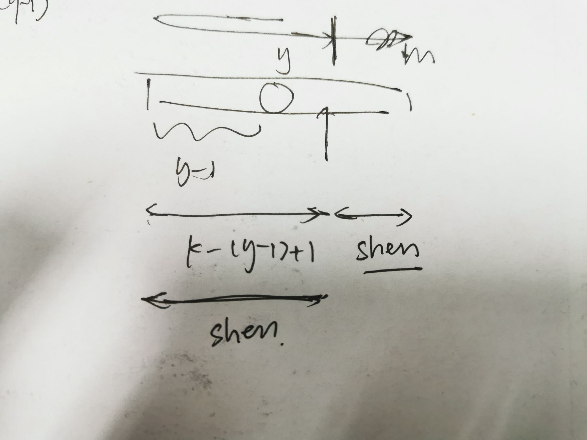

# 2020 ICPC 上海（热身赛

## AC 1/3  目标：-

[传送门](https://ac.nowcoder.com/acm/contest/9731)

**赛后补题目标** ：

**B - Strawberry** 

**C - circle**（已）

---

### WA：

**B - Strawberry** ： 少了一种情况

---

感觉都是可做的（

但是比赛到后面真的脑子会晕掉

---

## 需学习的知识点：


----

# ~

## B - Strawberry

**题意** ：有$n*m$的菜地 ，种草莓，起点在$(x,y)$，每天早上每个格子都会多长1颗草莓，下午可以移动到相邻格子或者呆在原地不动，晚上收草莓，问k天最多能收多少草莓，

分类（

思路：

+ 发现如果格子总数是偶数，必然可以得到一个循环，如果$k\leq n \times m$，可以发现每天拿的草莓必然是从1到k的等差数列；否则，最后每个格子剩下的草莓一定可以是0到$n \times m - 1$的等差数列

+ 然后考虑奇数，刚开始觉得奇数不能走出循环，后来发现**可以呆在原地不动并且是先移动后摘草莓**，可以先走到一个可以走完全图的点作为起点，（不必要循环），然后一直呆在原地不动，直到最后$n\times m$天开始移动，剩下的草莓数必然也是0到$n\times m - 1$的等差数列，于是可以**合并到第一种里面**去

+ 发现如果只有一行或者一列（把一列的情况的n和m互换，将nm全为1的情况特判），只剩下一行的情况，

  - 如果能先走到一边（任意）的端点然后返回走到另一边的端点，和第一种情况一样

  这里注意第一天可以先往边上挪一格（

  - 走不到长的那边的端点，相当于k天是1到k的等差
  - 走到一边端点后走不到起点，就是一个1到y-1的等差+一个2,4,6,8..的等差，
  - 走到一边端点后能走回到起点，给个图（），这里相当于shen这段全被拿过了，相比较于k天全拿走，每个格子少拿的构成一个等差，减去

  

  - ==漏掉一种情况==：先向一个方向走一小段然后掉头走到端点

   //设走的长度是x，k-y 是奇数，（起点是y + 1）$y + 2 \times x - 1 = k$

  $ans = k \times (y + x) - \frac{(0 + y + x - 1) \times (y + x)}{2}$

  k - y 为偶数

  

  case通过率为66.67%，我爬了

  

  先算全往左边，将点对称，相当于得到往左右的两种情况

  

---

##  C - Circle

**题意：**半径为1的圆上有n个点，给出每个点的位置，问将这些点移动使恰好等分圆所需要的最小的距离和

有个之前不知道的结论，~~于是大佬的代码主体部分就只有7行~~

> 退化成在一条线上的问题，就是找中位数
>
> （因为肯定是一个点去追下一个点是最优的，是一一对应的

先把每个点按角度排序，

第i个点减去$i \times \frac{360}{n}$

再按角度排序

将每个的角度和中位数点的距离（绝对值）加起来

将角度转化为圆上的距离

```cpp
#include <bits/stdc++.h>
using namespace std;

const int maxn = 100010;
const double pi = acos(-1.0);
double a[maxn];

int main() {
	int n;
	cin >> n;
	for(int i = 1; i <= n; ++i) {
		cin >> a[i];
	}
	
	sort(a + 1, a + n + 1);
	
	for(int i = 1; i <= n; ++i) {
		a[i] -= 360.0 / (double)n * (double)i;
	}
	
	sort(a + 1, a + n + 1);
	
	double ans = 0;
	for(int i = 1; i <= n; ++i) {
		ans += fabs(a[i] - a[(n + 1) / 2]);
	}
	
	cout << fixed << setprecision(10) << ans / 180.0 * pi << endl;
} 
```

