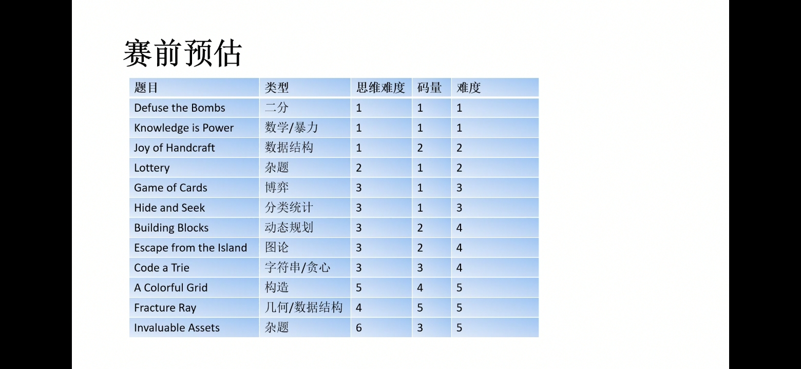

# CCPC绵阳 （2020 China Collegiate Programming Contest Mianyang Site

## AC 3/12  目标：

**赛后补题目标 ** ：

**7 - G - Game of Cards** 博弈 （已）

**10 - J - Joy of Handcraft** 数据结构 （已）

---

### WA : 

**12 - L - Lottery** 计算重复的时候有个地方没有考虑清楚

**7 - G - Game of Cards** 没有考虑边界（

### TLE : 

**12 - L - Lottery** 卡常，

---

**~~一些废话~~** ：

“为什么你们的正式赛和随便打打那种比赛差这么多 ？ ”

电脑又出了点问题，下次直接上笔记本好吧，

**排除项 ： 代码文件夹 和OMS 和监考录屏软件**



**金 ：** 五题 罚时600（五题前三

**银 ：** 四题 前一半

**铜 ：** 三题 前一半 罚时561（我们罚时597

---

## 需学习的知识点：


---

## ~

### 10 - J - Joy of Handcraft


---

### 7 - G - Game of Cards

**题意 ：** 有0123四种值的牌，每次可以选取两张值不超过3的牌将他们替换成他们的和，给出四种牌的数目，不能操作者输

思路上刚开始没有考虑123牌都为0的情况，

补题的时候代码上出现了一点逻辑错误，

```c++
if(a1 == 0 && a2 == 0 && a3 == 0) {
			if(a0 <= 1 || a0 % 2 == 1) {
				f = 0;
			}	
		} 
		else if(!(a0 & 1)) {
//......
```

刚开始写成了

```c++
if(a0 <= 1 && a1 == 0 && a2 == 0 && a3 == 0) {
			f = 0;
		}
		else if(a1 == 0 && a2 == 0 && a3 == 0 && (a0 & 1)) {
			f = 0;
		}
		else if(a1 == 0 && a2 == 0 && a3 > 0 && !(a0 & 1)) {
			f = 0;
		} 
		else if(!(a0 & 1)) {
//......
```

这里有些情况不满足会直接往后跳，但实际上它应该直接有结果了（？..

```c++
#include <bits/stdc++.h>
using namespace std;

typedef long long ll; 

int main() {
	//freopen("data.txt", "r", stdin); 
	//freopen("test.txt", "w", stdout);
	int T;
	cin >> T;
	
	int cas = 0;
	while(T --) {
		++ cas;
		ll a0, a1, a2, a3;
		cin >> a0 >> a1 >> a2 >> a3;
		
		int f = 1;
		
		if(a1 == 0 && a2 == 0 && a3 == 0) {
			if(a0 <= 1 || a0 % 2 == 1) {
				f = 0;
			}	
		} 
		else if(!(a0 & 1)) {
			if(a1 % 3 == 0) {
				f = 0;
			}
			else if(a1 % 3 == 1 && a2 == 0) {
				f = 0;
			}
		}
		else if(a0 & 1) {
			if(a1 % 3 == 1 && a2 > 0) {
				f = 0;
			}
			else if(a1 % 3 == 2 && a2 <= 1) {
				f = 0;
			}
		}
		
		if(!f) {
			cout << "Case #" << cas << ": Horse\n"; 
		} 
		else {
			cout << "Case #" << cas << ": Rabbit\n";
		}
	}
} 
```

---

