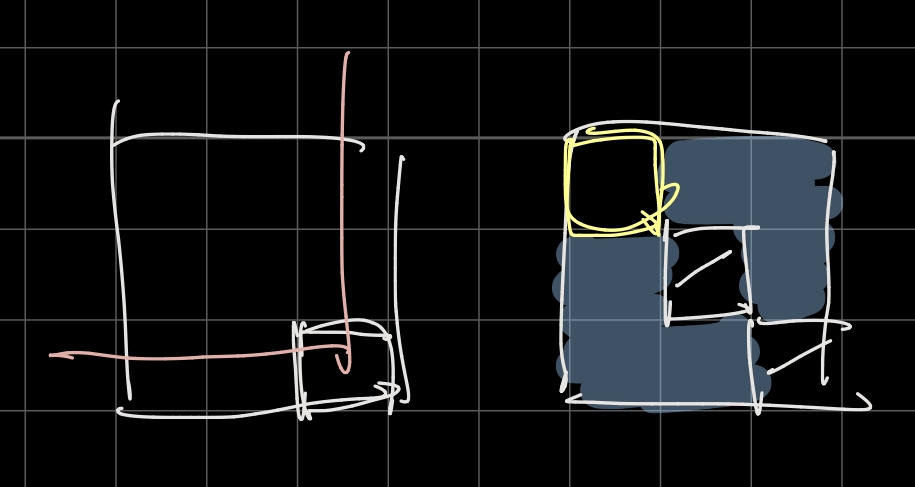

# 2020杭电多校10

## AC 5/11   目标：6/11

**赛后补题目标 ：1006（待）**

### WA：1

1011 ：k==0 没考虑

### PE：1

1011 ：行末空格

### TLE: 2

1007 ：cin没关同步

1007 ：数组开小了

## 需学习的知识点：

**博弈论再理一下** （1010）

---

# ~

## 1003 Mine Sweeper

**题意：** 扫雷游戏，给出一个n要求构造出所有数字之和为n的图，不能构造输出-1。

都能构造。

通过考虑每个雷的贡献，如果在角上并且连续则每个贡献3，在中间周围都无每个贡献8；

*贡献3：* 

```
X..           XX...
...			  .....
```

*贡献8：*

```
...
.X.
...
```

24以上的数都可以表示成 $3a+8b$ 的形式，24以下特判。

**code:**

```c++
#include<bits/stdc++.h>
using namespace std;
typedef long long ll;

char s[15][20],q[30][30];
void ts(int x,int y){
    fill(q[0],q[0]+900,'.');
    for(int i=0;i<25;i++){
        q[i][25]='\n';
        q[i][26]='\0';
    }
    for(int i=0;i<x;i++)q[0][i]='X';
    int i=2,j=1;
    while(y--){
        q[i][j]='X';
        j+=2;
        if(j==25)i+=2,j=1;
    }
}
int main() {
    #ifdef ONLINE_JUDGE
    #else
        //freopen("in.txt","r",stdin);
        //freopen("out.txt","w",stdout);
    #endif
    strcpy(s[0],"1 1\n.\n");
    strcpy(s[1],"1 2\nX.\n");
    strcpy(s[2],"1 3\n.X.\n");
    strcpy(s[4],"2 2\nXX\n..\n");
    strcpy(s[5],"2 3\n.X.\n...\n");
    strcpy(s[7],"2 3\nXXX\n...\n");
    strcpy(s[10],"3 3\n.X.\n...\n.X.\n");
    strcpy(s[13],"3 4\n....\nX.X.\n....\n");
    int nn;
    scanf("%d",&nn);
    int n;
    while(nn--){
        scanf("%d",&n);
        if(n==0||n==1||n==2||n==4||n==5||n==7||n==10||n==13){
            printf("%s",s[n]);
        }
        else{
            int x=0,y=0;
            while(n%3!=0){
                n-=8,y++;
            }
            int p=n/24;
            y+=p*3;
            n-=p*24;
            x=n/3;
            ts(x,y);
            printf("25 25\n");
            for(int i=0;i<25;i++)printf("%s",q[i]);
        }
    }
    return 0;
}
```


----

## 1004 Permutation Counting

**题意：**给出一个b数列，由01构成表示a数列的上升下降情况，问a数列的可能情况数目。（其中a是一个排列）

dp[i] [j] := 当前放到第i个数字，第i个数字的位置是j，

如果输入的是0，就往dp[i+1] [k]  (k>j)转移， 否则往 dp[i+1] [k] (k<=j)

压掉一维

**code：**

```c++
#include <bits/stdc++.h>
using namespace std;
typedef long long ll;
const ll mod = 1e9 + 7;
ll dp[5005];
int main() {
    ios::sync_with_stdio(0), cin.tie(0), cout.tie(0);
    int t;
    cin >> t;
    while (t--) {
        int n;
        cin >> n;
        int s = 1, e = n;
        for (int i = 1; i <= n; i++) dp[i] = 1;
        for (int i = 2; i <= n; i++) {
            int k;
            cin >> k;
            if (k) {
                e--;
                dp[s - 1] = 0;
                for (int i = s; i <= e; i++) {
                    dp[i] = (dp[i - 1] + dp[i]) % mod;
                }
            } else {
                s++;
                dp[e + 1] = 0;
                for (int i = e; i >= s; i--) {
                    dp[i] = (dp[i + 1] + dp[i]) % mod;
                }
            }
        }
        cout << dp[s] << endl;
    }
}

```


---

## 1011 Task Scheduler

**题意：**一共有n个任务，每个任务需要$p_i$个工人，有个随机分配系统，共有m个工人，其中有k个联系不上，对于每个任务对于空闲中的工人进行随机分配，如果随机到了联系不上的工人就要重新随机分配，直到成功分配，现在你可以改变任务的分配顺序，求期望分配数最少的分配方案。

若多种方案输出字典序最小。

~~榜是真的歪~~

**注意！！**k=0直接按123..n输出

行末空格

**code：**

```c++
#include <bits/stdc++.h>
using namespace std;
pair<int, int> a[10005];
bool cmp(pair<int, int> a, pair<int, int> b) {
    return a.first > b.first || a.first == b.first && a.second < b.second;
}
int main() {
    ios::sync_with_stdio(0), cin.tie(0), cout.tie(0);
    int t;
    cin >> t;
    while (t--) {
        int n, m, k;
        cin >> n >> m >> k;
        for (int i = 1; i <= n; i++) {
            cin >> a[i].first;
            a[i].second = i;
        }
        if (k == 0) {
            for (int i = 1; i <= n; i++) {
                cout << i;
                if (i != n) cout << ' ';
            }
            cout << endl;
            continue;
        }
        sort(a + 1, a + 1 + n, cmp);
        for (int i = 1; i <= n; i++) {
            cout << a[i].second;
            if (i != n) cout << ' ';
        }
        cout << endl;
    }
}
```

---

## 1010 Tic-Tac-Toe-Nim

**题意：**把9堆石子按$3*3$的位置摆放，第一轮Alice和Bob任取一整堆石子，之后每轮Alice和Bob轮流在某一堆中取正整数个数的石子，谁先使某行或某列上的石子个数全为0则赢。

 井字棋+Nim 

找到一些**必败态**：

```
0 1 1		1 1 0		0 1 1
1 0 1		1 0 1		1 1 0
1 1 0		0 1 1		1 0 1  ....
```

可以交换行或列的顺序，以上其实是同一种情况

假设alice先取右下角的点，bob不能取第3行或第3列的点，假设取中心点（其他情况可以平移得到

第一轮之后就变成了有两个0的情况，上图中的1一定会留到最后，相当于每堆石子-1进行nim博弈

后手必败当且仅当 右上角点的石子数与剩下6个点石子数各-1的异或和为0



~~有点点复杂刚开始有把自己绕进去，还考虑过到底是nim还是anti-nim,~~ 赛后打算仔细整理一下博弈论

**code：**

```c++
#include <bits/stdc++.h>
using namespace std;
int a[10][10];
int main() {
    ios::sync_with_stdio(0), cin.tie(0), cout.tie(0);
    int t;
    cin >> t;
    while (t--) {
        for (int i = 1; i <= 3; i++) {
            for (int j = 1; j <= 3; j++) {
                cin >> a[i][j];
            }
        }
        int cnt = 0;
        for (int i = 1; i <= 3; i++) {
            for (int j = 1; j <= 3; j++) {
                bool f = 1;
                for (int ii = 1; ii <= 3 && f; ii++) {
                    for (int jj = 1; jj <= 3 && f; jj++) {
                        if (ii == i || jj == j) continue;
                            int ans = 0;
                            for (int iii = 1; iii <= 3; iii++) {
                                for (int jjj = 1; jjj <= 3; jjj++) {
                                    if (iii == ii && jjj == jj ||
                                        iii == i && jjj == j)
                                        continue;
                                    else if (iii != ii && iii != i &&
                                             jjj != jj && jjj != j)
                                        ans^=a[iii][jjj];
                                    else ans ^= (a[iii][jjj] - 1);
                                }
                            }
                            if (!ans) {
                                f=0;
                            }
                    }
                }
                if(f)cnt++;
            }
        }
        cout << cnt << endl;
    }
}
```


---

## 1007 Coin Game

**题意：**有n台机器，每个机器有3个硬币，价值分别为$a_i,b_i,a_i$，（给出k1，k2两个随机种子然后由xorShift128Plus随机生成） 定义$f(x)$为取 x 枚硬币的最大价值 ，求$f(1)⊕f(2)⊕f(3)⊕\dots⊕f(m)$

将每台机器的贡献分为$a_i,a_i+b_i$两种，若取一枚硬币则取的$a_i$，两枚$a_i+b_i$，三枚都取

分别放在两个数组里面，设为 A 和 B （A中为$a_1\dots a_n$ ,B中为$a_1+b_1 \dots a_n+b_n$

从大到小排序，每次判断是否能再取两个，若能 判断是A数组中最先的两个价值更优还是B数组中最先的一个价值更优，贪心就好

```c++
#include <bits/stdc++.h>
using namespace std;
typedef long long ll;
typedef unsigned long long ull;

constexpr int threshold = 10000000;
unsigned long long k1, k2;

unsigned long long a[5000005], b[5000005];

unsigned long long xorShift128Plus() {
    unsigned long long k3 = k1, k4 = k2;
    k1 = k4;
    k3 ^= (k3 << 23);
    k2 = k3 ^ k4 ^ (k3 >> 17) ^ (k4 >> 26);
    return k2 + k4;
}

void gen(int n, unsigned long long _k1, unsigned long long _k2) {
    k1 = _k1;
    k2 = _k2;
    for (int i = 1; i <= n; ++i) {
        a[i] = xorShift128Plus() % threshold + 1;
        b[i] = xorShift128Plus() % threshold + 1;
    }
}
bool cmp(ull a, ull b) { return a > b; }

int main() {
    ios::sync_with_stdio(0), cin.tie(0), cout.tie(0);
    ull n, m;
    while (cin >> n >> m >> k1 >> k2) {
        gen(n, k1, k2);
        int l = 0, r = 0;
        ull sum = 0, ans = 0;
        for (int i = 1; i <= n; i++) b[i] += a[i];
        sort(a + 1, a + 1 + n, cmp);
        sort(b + 1, b + 1 + n, cmp);
        for (int i = 1; i <= m; i++) {
            if (l >= 1 && r < n && a[l + 1] + a[l] < b[r + 1]) {
                sum -= a[l--];
                sum += b[++r];
            } else
                sum += a[++l];
            ans ^= sum;
        }
        cout << ans << endl;
    }
    return 0;
}
```

----

## 1006 Divide and Conquer

**题意：**给出n个点的坐标（保证n是4的倍数，任意两点不重合，任意三点不共线）要求给出两条线将平面分成4个部分，并且每个部分的点的个数正好是$\frac{n}{4}$

考虑找重心

给两个随机数将坐标整体平移到第一象限，由（0,0）极角排序找第一条线将平面中的点分成$\frac{n}{2}$ 和 $\frac{n}{2}$

再来一遍，随机一个右下角点极角排序，找第二条线，

求交点

~~时间不够了也不知道对不对（bushi~~