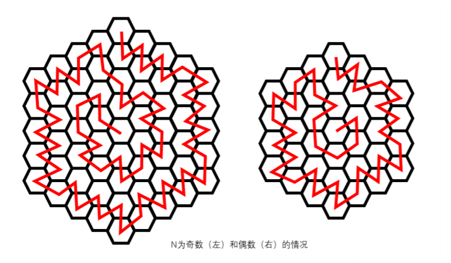

# 2020杭电多校8

---------------

## AC 4/12   目标：5/12 (

####赛后补题目标 ： 1004（已） 1011（已） 

### WA：2

1006 ：k当成1了

1008 ：i+=2 打成 i++

### TLE：1

1004 : 没快读 

## 需学习的知识点：

**LCT**  （1004）

**线性基**（1011)

-----------------

# ~

## 1003 Clockwise or Counterclockwise

**题意 ** ：给出圆心在原点的3个点，问给出的顺序是顺时针还是逆时针

签到题

赛时队友直接拿**atan2**秒了

题解是让用**向量叉积**

注意**longlong** 

**叉积**

```c++
#include <bits/stdc++.h>
using namespace std;

typedef long long ll;

struct node{
    ll x,y;
    node(){};
    node(ll _x,ll _y){
        x=_x; y=_y;
    }
    node operator - (const node & a){
        return ( node(x-a.x,y-a.y) );
    }
};

ll cross(node A,node B){
    return A.x*B.y-A.y*B.x;
}

int main(){
    int t;
    scanf("%d",&t);
    while(t--){
        node a,b,c;
        scanf("%lld%lld%lld%lld%lld%lld",&a.x,&a.y,&b.x,&b.y,&c.x,&c.y);
        if(cross(b-a,c-b) < 0) printf("Clockwise\n");
        else printf("Counterclockwise\n"); 
    }
} 
```

**atan2**

直接能给出极角

```c++
#include <bits/stdc++.h>
using namespace std;
const double Pi=3.14159265358979;

int main() {
#ifdef ONLINE_JUDGE
#else
    freopen("in.txt","r",stdin);
    //freopen("out.txt","w",stdout);
#endif
    double a,b,c,d,e,f;
    double g,h,i;
    int n;
    cin>>n;
    while(cin>>a>>b>>c>>d>>e>>f){
        g=atan2(b,a)+Pi;
        h=atan2(d,c)+Pi;
        i=atan2(f,e)+Pi;
        if((g>h&&h>i)||(h>i&&i>g)||(i>g&&g>h))printf("Clockwise\n");
        else printf("Counterclockwise\n");
    }
    return 0;
}
```

------------------


## 1006 Fluctuation Limit

**题意 ** ：n天每天有一个区间，并且有一个总的波动限制k，问是否能使所有区间成立的解，输出任意一种

**题解**  ： 如果 i 是在 [l, r] 范围内, 那么 i + 1 必须要在 [l − k, r + k] 范围内．这是因为如果 i + 1 选了 范围外的值, i 就无解了． 这样可以从左往右, 把左边的约束带到右边．再从右往左做一遍．最后剩下的区间应该就是可 行域．因为题目只要求一种方案, 全部选最低的即可．复杂度 O(n)．

**code**

```c++
#include <bits/stdc++.h>
using namespace std;
int a[200005], b[200005];
int c[200005], d[200005];
stack<int> s;
int main() {
    ios::sync_with_stdio(0), cin.tie(0), cout.tie(0);
    int t;
    cin >> t;
    while (t--) {
        int n, k;
        cin >> n >> k;
        for (int i = 1; i <= n; i++) cin >> a[i] >> b[i];
        c[1] = a[1];
        d[1] = b[1];
        bool ok = 1;
        for (int i = 2; i <= n; i++) {
            int k1 = c[i - 1] - k;
            int k2 = d[i - 1] + k;
            c[i] = max(a[i], k1);
            d[i] = min(b[i], k2);
            if (c[i] > d[i]) ok = 0;
        }
        if (!ok) {
            cout << "NO" << endl;
            continue;
        }
        while (!s.empty()) s.pop();
        s.push(d[n]);
        for (int i = n - 1; i > 0; i--) {
            int kk = s.top();
            kk += k;
            kk = min(kk, d[i]);
            s.push(kk);
        }
        cout << "YES" << endl;
        while (!s.empty()) {
            cout << s.top() << ' ';
            s.pop();
        }
        cout << endl;
    }
}
```

-----------------


## 1008 Hexagon

**题意 ** ：蜂窝状的地图实现不走直线的全覆盖

构造

~~刚开始乱画~~

队友有想过是否可以由三角形分块实现覆盖，后来发现不行。

发现能将图划分为宽度为2的环，然后从中心点开始，半径分奇偶

~~好像画出来了就是画出来了，没有什么套路~~




队友总结了一下规律 把每个环的走法变成了函数

code是逆时针的 和上图刚好相反 不过道理都是一样的嗯

```c++
#include <bits/stdc++.h>
using namespace std;

void pp(int x){
    if(x==2)printf("356123");
    else if(x==3){
        printf("324564615126231342");
    }
    else if(x%2==0){
        printf("23");
        for(int i=0;i<x-2;i++)printf("53");
        printf("5");
        for(int i=0;i<x-2;i++)printf("64");
        printf("6");
        for(int i=0;i<x-2;i++)printf("15");
        printf("1");
        for(int i=0;i<x-2;i++)printf("26");
        printf("2");
        for(int i=0;i<x-2;i++)printf("31");
        printf("3");
        for(int i=0;i<x-3;i++)printf("42");
        printf("3");
    }
    else{
        printf("324");
        for(int i=0;i<x-3;i++)printf("53");
        printf("5");
        for(int i=0;i<x-2;i++)printf("64");
        printf("6");
        for(int i=0;i<x-2;i++)printf("15");
        printf("1");
        for(int i=0;i<x-2;i++)printf("26");
        printf("2");
        for(int i=0;i<x-2;i++)printf("31");
        printf("3");
        for(int i=0;i<x-2;i++)printf("42");
    }
}
int main() {
    int n,x;
    scanf("%d",&n);
    while(n--){
        scanf("%d",&x);
        if(x%2==0){
            for(int i=2;i<=x;i+=2)pp(i);
        }
        else for(int i=3;i<=x;i+=2)pp(i);
        printf("\n");
    }
    return 0;
}
```

---------------

## 1009 Isomorphic Strings
枚举每一小段的长度，用字母个数和长度能否整除剪枝，然后直接哈希即可

```c++
#include <bits/stdc++.h>
using namespace std;
typedef long long ll;
const ll mod = 1e9 + 7;
const ll K = 233;
ll ha[6000000];
ll powk[6000000];
ll invk[6000000];
int alp[30];
int alp_part[30];
char s[6000000];

ll qpow(ll a, ll b) {
    ll ans = 1;
    while (b) {
        if (b & 1) ans = (ans * a) % mod;
        a = (a * a) % mod;
        b >>= 1;
    }
    return ans;
}
unordered_set<ll> p;
int main() {
    ios::sync_with_stdio(0), cin.tie(0), cout.tie(0);
    powk[0] = 1;
    for (int i = 1; i <= 5000000; i++) {
        powk[i] = powk[i - 1] * K % mod;
    }
    invk[5000000] = qpow(powk[5000000], mod - 2);
    for (int i = 4999999; i >= 0; i--) {
        invk[i] = invk[i + 1] * K % mod;
    }
    int t;
    cin >> t;
    while (t--) {
        int len;
        cin >> len;
        cin >> s + 1;
        memset(alp, 0, sizeof(alp));
        for (int i = 1; i <= len; i++) {
            alp[s[i] - 'a']++;
            ha[i] = (ha[i - 1] + powk[i] * (s[i] - 'a')) % mod;
        }
        bool ok = 0;
        for (int k = len; k >= 2; k--) {
            bool failed = 0;
            if (len % k) continue;
            for (int i = 0; i < 26; i++)
                if (alp[i] % k) failed = 1;
            if (failed) continue;
            int l = len / k;
            p.clear();
            for (int i = 0; i < l; i++) {
                ll tem = ((ha[l] - ha[i] + mod) * invk[i] % mod +
                          ha[i] * powk[l - i]) %
                         mod;
                p.insert(tem);
            }
            for (int i = 1; i < k; i++) {
                ll tem = (ha[i * l + l] - ha[i * l] + mod) * invk[i * l] % mod;
                if (p.count(tem) == 0) {
                    failed = 1;
                    break;
                }
            }
            if (failed) continue;
            ok = 1;
            break;
        }
        if (ok)
            cout << "Yes" << endl;
        else
            cout << "No" << endl;
    }
}
```


--------

## 1004 Discovery of Cycles

**LCT**裸题 ~~但是完全没学过~~

比赛时候找到了这个算法并且已有思路

紧急找板子然后改 ~~队友tql~~

因为真的不熟悉中间还换了好几个板子

最后是极限改完板子  然后t掉的 并且赛后发现使用快读就能过

~~说明不要轻易放弃希望,  套，都可以套板子（？~~

```c++
#include <bits/stdc++.h>
using namespace std;

const int N = 400000;

inline int read(){
    int X=0,w=0;char ch=0;
    while(!isdigit(ch)){w|=ch=='-';ch=getchar();}
    while(isdigit(ch))X=(X<<3)+(X<<1)+(ch^48),ch=getchar();
    return w?-X:X;
}

/* LCT {{{ */
struct LCT {
    int tree[N], val[N], fa[N], son[N][2], rev[N];
    int top, sta[N];
    void init() {
        memset(tree, 0, sizeof(tree));
        memset(val, 0, sizeof(val));
        memset(fa, 0, sizeof(fa));
        memset(son, 0, sizeof(son));
        memset(rev, 0, sizeof(rev));
        memset(sta, 0, sizeof(sta));
        top = 0;
    }
    bool isroot(int t) { return t != son[fa[t]][0] && t != son[fa[t]][1]; }
    bool isson(int t) { return t == son[fa[t]][1]; }
    void update(int t) { tree[t] = tree[son[t][0]] ^ tree[son[t][1]] ^ val[t]; }
    void pushdown(int t) {
        if (rev[t]) {
            rev[son[t][0]] ^= 1, rev[son[t][1]] ^= 1;
            swap(son[t][0], son[t][1]);
            rev[t] = 0;
        }
    }
    void rotate(int t) {
        int f = fa[t], g = fa[f], fis = isson(f), tis = isson(t);
        fa[t] = g;
        if (!isroot(f)) son[g][fis] = t;
        fa[son[t][tis ^ 1]] = f, son[f][tis] = son[t][tis ^ 1];
        fa[f] = t, son[t][tis ^ 1] = f;
        update(f), update(t);
    }
    void splay(int t) {
        sta[top = 1] = t;
        int x = t;
        while (!isroot(x)) x = fa[x], sta[++top] = x;
        while (top) pushdown(sta[top--]);
        while (!isroot(t)) {
            int f = fa[t];
            if (isroot(f))
                rotate(t);
            else if (isson(f) == isson(t))
                rotate(f), rotate(t);
            else
                rotate(t), rotate(t);
        }
        update(t);
    }
    void access(int t) {
        for (int i = 0; t; i = t, t = fa[t]) splay(t), son[t][1] = i, update(t);
    }
    void makeroot(int t) { access(t), splay(t), rev[t] ^= 1; }
    int findroot(int t) {
        access(t), splay(t);
        while (son[t][0]) pushdown(t), t = son[t][0];
        splay(t);
        return t;
    }
    void split(int u, int v) { makeroot(v), access(u), splay(u); }
    void link(int u, int v) {
        makeroot(u);
        if (findroot(v) != u) fa[u] = v;
    }
    void cut(int u, int v) {
        split(u, v);
        if (son[u][0] == v && !son[v][1]) son[u][0] = 0, fa[v] = 0;
    }
};
/* }}} */

LCT lct;
int from[400000], to[400000];
int last[400000];

int main() {
    /* int n, m;
     scanf("%d%d", &n, &m);
     for (int i = 1; i <= n; ++i) scanf("%d", &lct.val[i]);
     for (int i = 1; i <= m; ++i) {
         int opt, x, y;
         scanf("%d%d%d", &opt, &x, &y);
         if (opt == 0) lct.split(x, y), printf("%d\n", lct.tree[x]);
         if (opt == 1) lct.link(x, y);
         if (opt == 2) lct.cut(x, y);
         if (opt == 3) lct.splay(x), lct.val[x] = y;
     }
     return 0;*/
    //ios::sync_with_stdio(0), cin.tie(0), cout.tie(0);
    int t;
    //cin >> t;
    t=read();
    while (t--) {
        int n, m, q;
        lct.init();
        //cin >> n >> m >> q;
        n=read(); m=read(); q=read(); 
        bool lastans = 0;
        for (int i = 1; i <= m; i++){
        	//cin >> from[i] >> to[i];
        	from[i]=read();
        	to[i]=read();
		} 
        int p = 1;
        for (int i = 1; i <= m; i++) {
            if (i > 1) lct.cut(from[i - 1], to[i - 1]);
            while (p <= m && lct.findroot(from[p]) != lct.findroot(to[p])) {
                lct.link(from[p], to[p]);
                p++;
            }
            last[i] = p;
        }
        for (int i = 1; i <= q; i++) {
            int a, b;
            //cin >> a >> b;
            a=read(); b=read();
            a = (a ^ lastans) % m + 1;
            b = (b ^ lastans) % m + 1;
            int aa = min(a, b);
            int bb = max(a, b);
            if (bb >= last[aa]) {
                //cout << "Yes" << endl;
                printf("Yes\n");
                lastans = 1;
            } else {
                //cout << "No" << endl;
                printf("No\n"); 
                lastans = 0;
            }
        }
    }
}
```


----------------------

## 1011 Kidnapper's Matching Problem

**题意 ** ：有一个A串一个B串，问B串在A串中的哪些位置可以实现xor匹配（异或和为给定集合S的异或子集），计算一个公式给出答案

考虑了集合S的范围（个数<=100) ，生成的子集个数可能达到$2^{100}$，觉得难以判断

~~对英文缩写不敏感（题目缩写刚好也是kmp有提示）~~= = 虽然不是因为kmp不会

看了题解之后才知道有个东西叫**线性基**

[线性基详解](https://blog.csdn.net/a_forever_dream/article/details/83654397)  （这个讲的还挺清楚的

**OI-wiki**  [线性基](https://oi-wiki.org/math/basis/)

**线性基插入操作**

(结合代码)

对原集合的每个数x转为2进制，从高位向低位扫，对于当前位为1的，若d[i]不存在就令d[i]=x，否则令x=x`xor`d[i]

**code**

```c++
void add(ll x){
    for(int i=60;i>=0;i--){
        if(x&(1ll<<i)){//i>31 1->1ll
            if(d[i])x^=d[i];
            else{
                d[i]=x;
                break;//插入成功就退出
            }
        }
    }
}
```

**题解 ** 先用 S 数组计算其线性基，得到$2^S_⊕$ 。 然后把a[], b[]数组中的数去掉线性基中有的位得到 a‘[]，b‘[]。对于每一段能够能够按题意匹配的位置 i ,有 a‘[i]=b‘[i] 。 然后用KMP做。

贴一个丑陋的代码 ， 刚开始狂t ，cin 改 scanf 改 快读 ，然后对照题解发现是kmp的初始化直接用memset导致很慢。（因为保证n的和不会很大）

**code**

```c++
#include<bits/stdc++.h>
using namespace std;

typedef long long ll;
const int maxn=2e5+10;
const ll mod=1e9+7;

inline int read(){
    int X=0,w=0;char ch=0;
    while(!isdigit(ch)){w|=ch=='-';ch=getchar();}
    while(isdigit(ch))X=(X<<3)+(X<<1)+(ch^48),ch=getchar();
    return w?-X:X;
}

//

const int maxbit = 62;		//maxbit不能太大

struct L_B{
	ll lba[maxbit];
	L_B(){
        memset(lba, 0, sizeof(lba));
    }
    void Init(){
    	memset(lba,0,sizeof lba);
	}
    
	void Insert(ll val){		//插入
        for(int i = maxbit - 1; i >= 0; -- i) // 从高位向低位扫  
            if(val & (1ll << i)){ // 
                if(!lba[i]){
                    lba[i] = val;
                    break;
                }
                val ^= lba[i];
            }
    }
};
//对原集合的每个数val转为2进制，从高位向低位扫，对于当前位为1的，若lba[i]不存在就令lba[i]=x，否则令val=val`xor`lba[i]
// --------------线性基模板

L_B lb;

ll a[maxn],b[maxn],s[maxn];
int n,m,k;

int nxt[maxn];
int vis[maxn];

void get_next(){
    int i = 1, j = 0;
    nxt[1] = 0;
    while(i <= m){
        if(j == 0 || b[i] == b[j]){
            i ++, j ++, nxt[i] = j;
        }
        else j = nxt[j];
    }
}

void KMP(){
    get_next();
    int i = 0, j = 0;
    while(i <= n && j <= m){
        if(j == 0 || a[i] == b[j]) i++, j++;
        else j = nxt[j];
        
        if(j == m + 1){
            vis[i - m] = 1;
            j = nxt[j];
        }
    }
}

void init(){
	//memset(vis,0,sizeof vis);
	//memset(nxt,0,sizeof nxt);
	for(int i=0;i<=n;++i){
		vis[i]=0; nxt[i]=0;
	}
}

int main(){
	//ios::sync_with_stdio(0), cin.tie(0), cout.tie(0);
	int t;
	//scanf("%d",&t);
	t=read();
	while(t--){
		//int n,m,k;
		lb.Init();
		//cin>>n>>m>>k;
		n=read(); m=read(); k=read();
		for(int i=1;i<=n;++i){
			//cin>>a[i];
			//scanf("%lld",&a[i]);
			a[i]=read();
		}
		for(int i=1;i<=m;++i){
			//cin>>b[i];
			//scanf("%lld",&b[i]);
			b[i]=read();
		}
		for(int i=1;i<=k;++i){
			//cin>>s[i];
			//scanf("%lld",&s[i]);
			s[i]=read();
			lb.Insert(s[i]);
		}
		for(int i=1;i<=n;++i){
			for(int j=maxbit-1;j>=0;--j){
				if((a[i]>>j)&1){
					a[i]=a[i]^lb.lba[j];
				}
			}
		}
		for(int i=1;i<=m;++i){
			for(int j=maxbit-1;j>=0;--j){
				if((b[i]>>j)&1){
					b[i]=b[i]^lb.lba[j];
				}
			}
		}
		init(); KMP();
		ll res = 0, tmp = 1;
        for(int i = 1; i <= n - m + 1; ++ i){
            if(vis[i]) res = (res + tmp) % mod;
            tmp = tmp * 2ll % mod;
        }
        printf("%lld\n",res);
	}
} 
```


--------------

