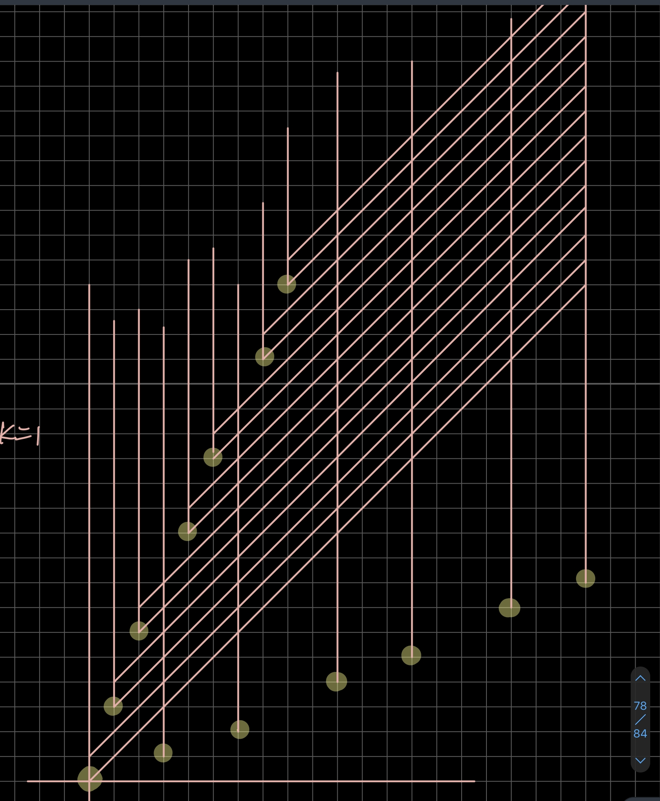

---------------

# 2020杭电多校9

## AC 2/10   目标：3/10

**赛后补题目标 ：1007（？待）**

### WA：2

1003 ：公式推错了

1003 ：精度不够

## 需学习的知识点：

**平衡树，splay** （1007）

**威佐夫博弈，Beatty定理** （1003）

------

# ~

## 1001 Tree

树形dp

```c++
#include <bits/stdc++.h>
using namespace std;
typedef long long ll;
const ll maxn = 500005;
vector<ll> g[maxn];
ll subtree[maxn];
ll par[maxn];
ll ans, tot;
ll dfs(ll u, ll fa) {
    subtree[u] = 1;
    for (ll i = 0; i < g[u].size(); i++) {
        ll v = g[u][i];
        if (v == fa) continue;
        subtree[u] += dfs(v, u);
    }
    ans += subtree[u];
    return subtree[u];
}
ll add[maxn];
ll cal(ll u) {
    if (add[u]) return add[u];
    if (u == 1) return 0;
    return add[u] = tot - subtree[u] + cal(par[u]);
}
int main() {
    ios::sync_with_stdio(0), cin.tie(0), cout.tie(0);
    ll t;
    cin >> t;
    while (t--) {
        ll n;
        cin >> n;
        for (ll i = 1; i <= n; i++) {
            g[i].clear();
            add[i] = 0;
        }
        for (ll i = 2; i <= n; i++) {
            cin >> par[i];
            g[par[i]].push_back(i);
            g[i].push_back(par[i]);
        }
        ans = 0;
        tot = dfs(1, -1);
        ll mmax = 0;
        for (ll i = 2; i <= n; i++) {
            mmax = max(mmax, cal(i));
        }
        cout << ans + mmax << endl;
    }
}
```


-----

## 1003 Slime and Stones

**题意：**两堆石头数量分别为A , B ，给一个数k。 拿石子的方式有两种：从任意一堆里面取任意数量的石子，或者从两堆里面分别取差不超过k的个数的石子，先拿完石子则胜，问先手是否有必胜策略。

威佐夫博弈加一个k的限制



比赛时候的草稿，k=1的情况 , 黄色是必败点，粉色删去的是能到达必败点的点（即必胜点），

**威佐夫博弈**的结论 ：

设两堆石子(x , y) (x < y)  则先手必败，当且仅当 $(y - x)*\frac{\sqrt{5}+1}{2}=x$

此时k=0， 猜测 k$\neq$0 时结论类似， **sg函数**打表找斜率 ~~由于double不精确~~ 公式推错，WA了一发

找规律发现：

$a_0=b_0=0$

$b_i=a_i+i*(k+1)$

其中$a<b$ ，i 是指第几个 ，$a_i$是每次未出现的最小的正整数

~~但是数据范围太大了,~~ A, B, k都达到了 $10^8$

**Beatty定理**

$\frac{1}{\alpha}+\frac{1}{\beta}=1$ 其中$\alpha$，$\beta$是正无理数

记P=[na] (n为任意的正整数)，Q=[nb] (n为任意的正整数)
则P与Q是$Z^+$的一个划分，即P∩Q为 $\emptyset$ 且P∪Q为$N^+$

**Beatty序列**

取正无理数$\alpha$，$\beta$使得$\frac{1}{\alpha}+\frac{1}{\beta}=1$ 
构造两个数列$a_n$，$b_n$通项分别为
$a_n=[\alpha n]$
$b_n=[\beta n]$
$a_n$为小于等于$\alpha n$的最大整数
$b_n$为小于等于$\beta n$的最大整数

构造出的数列显然都是正整数数列

Beatty定理指出，两个数列都是严格递增的，并且每个正整数在两个数列中出现且仅出现一次。

**威佐夫博弈奇异局势**的规律非常符合**Beatty定理**

推公式得出$a_i=\frac{i*(1-k+\sqrt{(k+1)^2+4})}{2}$

$b_i=a_i+i*(k+1)$

拿这个冲了一发，然后又WA了，想了想可能是精度问题，

加了一个判断$abs(B-A)$ 是否是 $(k+1)$的倍数进行剪枝

**code :**

```c++
#include<bits/stdc++.h>
using namespace std;
typedef long long ll;

int main(){
    ll x,y,k,n;
    scanf("%lld",&n);
    while(n--){
        scanf("%lld%lld%lld",&x,&y,&k);
        if(x>y)swap(x,y);
        if((y-x)%(k+1)!=0){
            printf("1\n");
            continue;
        }
        ll i=(y-x)/(k+1);
        double p=(1.0-k+sqrt(4.0+(k+1)*(k+1)))/2;
        if(x==(int)(p*i))printf("0\n");
        else printf("1\n");
    }
    return 0;
}
```


[威佐夫博弈](https://blog.csdn.net/wu_tongtong/article/details/79295069)


------


## 1007 Game

[oi-wiki splay](https://oi-wiki.org/ds/splay/)

[洛谷splay模板](https://www.luogu.com.cn/problem/P3391)

**题解** ：直接模拟。每次操作等价于找到连续⼀段都>=y的段，然后左移⼀位，使⽤平衡树维护即可。


