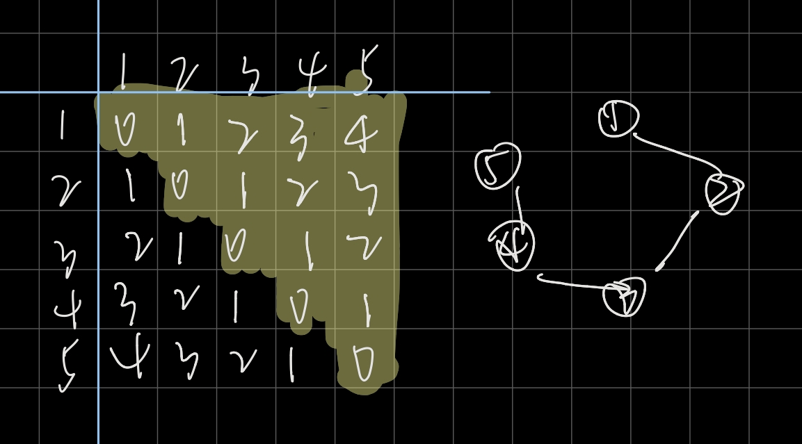

#9.23省赛训练（UFPE Stars Final Try-Outs 2019 Recife,Brazil,Dec 1,2018）

## AC 7/13   目标：9/13(

**赛后补题目标 ** ：

**G - Gabrielmetry ** (已)

**A - Awesome Brother **（待）

### WA：16 

**问就是读错题呗，读题的大失败**

E : (*2) 没理解题意不知道刚开始怎么过的样例

H : (*2) 题目要求输出对d取模的方案数，当不存在时报告，但有可能取模完为0，但存在方案

D : (*5) 题目没有明说01怎么处理，并且可以正做反做的情况下刚开始选择了更为麻烦的一种，后来重构代码了

J :  ~~算是~~读错题，应该是链，当成环做了

A  : (*6)

### CE: 1

A ： 把所有的int都改成了longlong，包括`int main()`

### TLE : 1

D ：wa傻了，题目没说如果有0和1会怎样，试试有没有0或1

---

**~~一些废话~~** ：这次和出题人不在一个频道~~（确信~~

理解题目都要绕个弯的那种

有个circuit到底是环还是链的问题，有个边界不懂他要怎么样直接靠试，并且签到题直接想复杂，可以说是很不顺...

其实这场的可做题还是很多的

不过处理的还行，换题重写都比较果断吧，（强行）

~~赛后有点点暴躁，赛中可能也有点急，但是再来一次也不能说一定能做的多好，只能说多碰碰这种情况也好。~~

这次wa的有点多，~~虽然最后有道题看时间差不多了开始乱冲，并且另外有题边界靠试，还有题没读懂（算是吧），~~加油！！

心态要好心态要好心态要好稳住稳住稳住

---

## 需学习的知识点：


---

## F - Fairy, the treacherous mailman 

**题意** ：n个数的错排种类

```c++
#include<bits/stdc++.h>
using namespace std;
typedef long long ll;
#define IOS ios::sync_with_stdio(NULL),cin.tie(nullptr),cout.tie(nullptr)
#define pb push_back

const ll mod=1e9+7;
const int N=1e6+10;

ll fac[100];

ll qpow(ll a,ll b){
    ll ans=1;
    while(b){
        if(b&1) ans=(ans*a)%mod;
        a=(a*a)%mod;
        b>>=1;
    }
    return ans;
}

int main(){
    IOS;
    ll n;
    fac[0]=1;
    for(int i=1;i<100;i++){
        fac[i]=fac[i-1]*i%mod;
    }
    cin>>n;
    ll ans=0;
    for(int i=0;i<=n;i++){
        ll tem=fac[n]*qpow(fac[i],mod-2)%mod;
        if(i&1) ans-=tem;
        else ans+=tem;
        ans=(ans+mod)%mod;
    }
    cout<<ans;
}
```

---

##M - Marvelous Necklace 

**题意** ： 给一串只有两个颜色的项链，问是否可以分成连续的两部分，使得两个部分每种颜色的数量对应相等，

```c++
#include<bits/stdc++.h>
using namespace std;
typedef long long ll;
#define IOS ios::sync_with_stdio(NULL),cin.tie(nullptr),cout.tie(nullptr)
#define pb push_back

const ll mod=1e9+7;
const int N=1e6+10;
string s;
int main(){
    IOS;
    cin>>s;
    int numa=0;
    int len=s.length()/2;
    if(s.length()&1){
        cout<<"NO"<<endl;
        return 0;
    }
    int cnt1=0,cnt2=0;
    for(auto x:s){
        if(x=='A') cnt1++;
        else cnt2++;
    }
    if((cnt1&1)||(cnt2&1)) {
        cout<<"NO"<<endl;
        return 0;
    }
    cnt1/=2;
    cnt2/=2;
    int c1=0,c2=0;
    for(int i=0;i<len;i++){
        if(s[i]=='A') c1++;
        else c2++;
    }
    if(c1==cnt1&&c2==cnt2){
        cout<<"YES"<<endl;
        cout<<1<<' '<<len+1;
        return 0;
    }
    for(int i=len;i<s.length();i++){
        if(s[i]=='A') c1++;
        else c2++;
        if(s[i-len]=='A') c1--;
        else c2--;
        if(c1==cnt1&&c2==cnt2){
            cout<<"YES"<<endl;
            cout<<i-len+2<<' '<<i+2;
            return 0;
        }
    }
    cout<<"NO"<<endl;
    return 0;
}
```

---

## E - Expectations sky-high

**题意** ：给一棵树，问树上任意两点间距离的期望，（两点可以相同）

算每一条边的贡献

实际上是算一半，即图中黄色荧光笔的部分（横竖都为节点，交回处为该两点间的距离，图示为样例情况

```
input
5
1 2
2 3
3 4
4 5

output
333333337
```



```c++
#include<bits/stdc++.h>
using namespace std;
typedef long long ll;
vector<int> g[300000];
int siz[300000];

const ll mod=1e9+7;

ll qpow(ll a,ll b){
    ll ans=1;
    while(b){
        if(b&1) ans=(ans*a)%mod;
        a=(a*a)%mod;
        b>>=1;
    }
    return ans;
}

int dfs(int u,int fa){
    siz[u]=1;
    for(auto v:g[u]){
        if(v==fa) continue;
        siz[u]+=dfs(v,u);
    }
    return siz[u];
}

int main(){
    ios::sync_with_stdio(0),cin.tie(0),cout.tie(0);
    ll n;
    cin>>n;
    for(int i=1;i<n;i++){
        int a,b;
        cin>>a>>b;
        g[a].push_back(b);
        g[b].push_back(a);
    }
    dfs(1,-1);
    ll ans=0;
    for(int i=1;i<=n;i++){
        ans=(ans+siz[i]*(n-siz[i]))%mod;
    }
    ans=(ans*qpow(n*(n+1)/2%mod,mod-2))%mod;
    cout<<ans<<endl;
    return 0;
}
```

---

## L - Looter of Fridges 

**题意** ：有一个冰箱，里面刚开始有n份午餐，每份午餐有一个好吃程度，一个警戒程度，一个消失时间，有个小偷来偷午餐，q次询问， 问当$t_i$时刻来的时候警戒上限为$l_i$能偷走最大好吃程度的午餐的好吃程度（多份为总和）

将从某时刻消失倒序变为离线从某时刻出现，每出现一份午餐，做一次好吃程度为价值，警戒程度为重量的01背包，

```c++
#include<bits/stdc++.h>
using namespace std;
typedef long long ll;

ll dp[10005];
struct dish{
    ll tas;
    int w,t;
    bool operator<(dish x){
        return t>x.t;
    }
}di[10005];
struct query{
    int num,t,w;
    ll ans;
    bool operator<(query x){
        return t>x.t;
    }
}qu[200005];
bool cmp(query a,query b){
    return a.num<b.num;
}
int main(){
    int n,q;
    scanf("%d%d",&n,&q);
    for(int i=0;i<n;i++){
        scanf("%lld%d%d",&di[i].tas,&di[i].w,&di[i].t);
    }
    sort(di,di+n);
    for(int i=0;i<q;i++){
        scanf("%d%d",&qu[i].t,&qu[i].w);
        qu[i].num=i;
    }
    sort(qu,qu+q);
    memset(dp,0,sizeof(dp));
    int cnt=0;
    for(int i=0;i<q;i++){
        for(;di[cnt].t>qu[i].t;cnt++){
            for(int j=10000;j>=0;j--){
                if(j+di[cnt].w<=10000)dp[j+di[cnt].w]=max(dp[j+di[cnt].w],dp[j]+di[cnt].tas);
            }
        }
        qu[i].ans=dp[qu[i].w];
    }
    sort(qu,qu+q,cmp);
    for(int i=0;i<q;i++)printf("%lld\n",qu[i].ans);
    return 0;
}
```

---

## H - Hyperpath

**题意** ： 给一张图，可以重复走，问其中长度为k的路径在取模d的情况下有几条，若不存在特别输出

离散可达矩阵，矩阵快速幂模板题

~~wa121是没想到的~~

后来想都wa在这么后面了，有没有可能是取模的时候将答案取模为了0，但实际上是有路径存在的

又加了一遍另一个取模的快速幂来判断就过了

```c++
#include<bits/stdc++.h>
using namespace std;
typedef long long ll;
//矩阵类模板
bool f=0;
const ll maxn=105;
const ll maxm=105;
ll mod;
struct Matrix{

    ll n,m;

    ll a[maxn][maxm];

    void clear(){

        n=m=0;

        memset(a,0,sizeof(a));

    }

    Matrix operator +(const Matrix &b) const {

        Matrix tmp;

        tmp.n=n;tmp.m=m;

        for (ll i=0;i<n;++i)

            for(ll j=0;j<m;++j)

                tmp.a[i][j]=a[i][j]+b.a[i][j];

        return tmp;

    }

    Matrix operator -(const Matrix &b)const{

        Matrix tmp;

        tmp.n=n;tmp.m=m;

        for (ll i=0;i<n;++i){

        	for(ll j=0;j<m;++j)

                tmp.a[i][j]=a[i][j]-b.a[i][j];

		}


        return tmp;

    }

    Matrix operator * (const Matrix &b) const{

        Matrix tmp;

        tmp.clear();

        tmp.n=n;tmp.m=b.m;

        for (ll i=0;i<n;++i)

            for(ll j=0;j<b.m;++j)

                for (ll k=0;k<m;++k){

                    tmp.a[i][j]+=a[i][k]*b.a[k][j];

                    tmp.a[i][j]%=mod;

                }

        return tmp;

    }

    Matrix get(ll x){//幂运算

        Matrix E;

        E.clear();

        E.n=E.m=n;

        for(ll i=0;i<n;++i)

            E.a[i][i]=1;

        if(x==0) return E;

        else if(x==1) return *this;

        Matrix tmp=get(x/2);

        tmp=tmp*tmp;

        if(x%2) tmp=tmp*(*this);

        return tmp;

    }

};

//矩阵模板结束


int main(){
    ll n,m;
    ll k;
    ll st,ed;
    scanf("%lld%lld%lld",&n,&m,&mod);
    scanf("%lld%lld%lld",&k,&st,&ed);
    Matrix mat;
    mat.clear();
    mat.n=mat.m=n;
    for(ll i=0;i<m;i++){
        ll u,v;
        scanf("%lld%lld",&u,&v);
        mat.a[u][v]++;
        mat.a[v][u]++;
    }
    ll modx=0x3f3f3f3f3f3f3f3f;
    swap(mod,modx);
    Matrix mat2=mat.get(k);
    if(mat2.a[st][ed])f=1;
    swap(mod,modx);
    mat=mat.get(k);
    if(mat.a[st][ed])f=1;
    if(f)printf("%lld",mat.a[st][ed]);
    else printf("Mendes will sleep in peace.");
    return 0;
}
```

---

## D - Dumb feature

**题意** ： 手机九键键盘，给一些名字（字符串），当输入一串数字的时候问能有多少名字以它为前缀

~~题目没有说清楚01的情况是为空还是直接没有答案，我们当时脑子糊了没有常识~~

并且刚开始的做法把数字转化成字母，边界很多，容易出bug

建tire树，把字母转化成数字做

```c++
#include<bits/stdc++.h>
using namespace std;
typedef long long ll;
#define IOS ios::sync_with_stdio(NULL),cin.tie(nullptr),cout.tie(nullptr)
#define pb push_back

int idx(const char &c) { return c - '0'; }

struct Trie {
    static const int maxnode = 2000005;
    static const int sigma_size = 26;
    int ch[maxnode][sigma_size];
    int val[maxnode];
    int siz[maxnode];
    int sz;

    Trie() {
        sz = 1;
        memset(ch[0], 0, sizeof(ch[0]));
        val[0]=0;
    }

    void dfs(int k){
        siz[k]=val[k];
        for(int i=0;i<sigma_size;i++){
            if(ch[k][i]) {
                dfs(ch[k][i]);
                siz[k]+=siz[ch[k][i]];
            }
        }
    }


    void insert(string s, int v) {
        int u = 0, n = s.length();
        for (int i = 0; i < n; i++) {
            int c = idx(s[i]);
            if (!ch[u][c]) {
                memset(ch[sz], 0, sizeof(ch[sz]));
                val[sz] = 0;
                ch[u][c] = sz++;
            }
            u = ch[u][c];
        }
        val[u]++;
    }

    int find(string s) {
        int u = 0, n = s.length();
        for (int i = 0; i < n; i++) {
            int c = idx(s[i]);
            if (!ch[u][c]) return 0;
            u = ch[u][c];
        }
        return siz[u];
    }
} trie;

char chang(char c){
    if(c<='c') return '2';
    if(c<='f') return '3';
    if(c<='i') return '4';
    if(c<='l') return '5';
    if(c<='o') return '6';
    if(c<='s') return '7';
    if(c<='v') return '8';
    else return '9';
}

int main(){
    IOS;
    int n,m;
    cin>>n>>m;
    for(int i=1;i<=n;i++){
        string s;
        cin>>s;
        for(auto& x:s){
            x=chang(x);
        }
        trie.insert(s,1);
    }
    trie.dfs(0);
    for(int i=1;i<=m;i++){
        string s;
        cin>>s;
        cout<<trie.find(s)<<endl;
    }
}
```

---

## J - Joseph and Tests 

**题意** ： 在1~n成链的点上，有两种操作，1把第idx的点的高度变为hei，2问从x点出发当人的高度可以改变的值为d时最远能走到哪里

刚开始以为说在1~n的环上做这个

```c++
#include<bits/stdc++.h>
using namespace std;
typedef long long ll;
const int N=1<<18;

int tree[N<<1];
int h[N],n;

void build(int k,int l,int r){
    if(l==r){
        int pre=h[l-1];
        if(l==1) pre=h[n];
        tree[k]=abs(h[l]-pre);
        return;
    }
    int mid=(l+r)>>1;
    build(k<<1,l,mid);
    build(k<<1|1,mid+1,r);
    tree[k]=max(tree[k<<1],tree[k<<1|1]);
}

int query(int k,int l,int r,int ql,int qr){
    if(ql<=l&&r<=qr) return tree[k];
    if(r<ql||qr<l) return 0;
    int mid=(l+r)>>1;
    return max(query(k<<1,l,mid,ql,qr),query(k<<1|1,mid+1,r,ql,qr));
}

void change(int k,int x){
    k=k+N-1;
    tree[k]=x;
    k>>=1;
    while(k){
        tree[k]=max(tree[k<<1],tree[k<<1|1]);
        k>>=1;
    }
}

int main(){
    ios::sync_with_stdio(0),cin.tie(0),cout.tie(0);
    int m;
    cin>>n;
    for(int i=1;i<=n;i++){
        cin>>h[i];
    }
    build(1,1,N);
    cin>>m;
    for(int i=1;i<=m;i++){
        int a,b;
        cin>>a;
        if(a==1){
            cin>>a>>b;
            h[a]=b;
            int pre=a-1,nxt=a+1;
            if(pre==0) pre=n;
            if(nxt==n+1) nxt=1;
            change(a,abs(h[a]-h[pre]));
            change(nxt,abs(h[nxt]-h[a]));
        }else {
            cin>>a>>b;
            int l,r,mid;
            l=a+1,r=n+1;
            while(l<r){
                mid=(l+r)>>1;
                if(query(1,1,N,l,mid)<=b){
                    l=mid+1;
                }else {
                    r=mid;
                }
            }
            cout<<l-1<<endl;
        }
    }
}

```

---

## G - Gabrielmetry 

**题意** ：说是二维平面的点，和坐标没有关系只有长度有用，并且只可能在线段上缺了几个端点

签到题，然后题目没读清楚，以为点可以在线段外，然后就没思路

```c++
#include <bits/stdc++.h>
using namespace std;

const double eps = 1e-5;

vector<double> a, b;

double dis(double x1, double y1, double x2, double y2){
	return sqrt((x2 - x1) * (x2 - x1) + (y2 - y1) * (y2 - y1));
}

int cmp(double x, double y){
	if(fabs(x - y) <= eps) return 0;
	if(x > y) return 1;
	return -1;
}

int main(){
	int n, m;
	cin >> n >> m;
	double x, y;
	double tmpx, tmpy;
	cin >> tmpx >> tmpy;
	for(int i = 1; i < n; ++ i){
		cin >> x >> y;
		a.push_back(dis(x, y, tmpx, tmpy));
		tmpx = x, tmpy = y; 
	}
	cin >> tmpx >> tmpy;
	for(int i = 1; i < m; ++ i){
		cin >> x >> y;
		b.push_back(dis(x, y, tmpx, tmpy));
		tmpx = x, tmpy = y; 
	}
	
//	for(int i = 0; i < a.size(); ++ i){
//		cout << a[i] << " "; 
//	} 
//	cout << endl;
//	
//	for(int i = 0; i < b.size(); ++ i){
//		cout << b[i] << " ";
//	}
//	cout << endl;
	
	int idxa = 0, idxb = 0;
	int ans = 0;
	while(idxa < a.size() && idxb < b.size()){
		
		if(cmp(a[idxa] ,b[idxb]) == 0){
			idxa ++, idxb ++;
		}
		else if(cmp(a[idxa] ,b[idxb]) > 0){
			a[idxa] -= b[idxb];
			ans ++;
			idxb ++;
		}
		else if(cmp(a[idxa] ,b[idxb]) < 0){
			b[idxb] -= a[idxa];
			ans ++;
			idxa ++;
		}
	}
	
	cout << ans; 
}
```


---

## A - Awesome Brother 

**题意** ：手机九键键盘上以象棋马的走法去跳，问这样以k为起点长度为n且不包含子串t的字符串有多少个

感觉是dp，写炸了

最后时间紧就冲了很多发，~~结束了也没过~~

