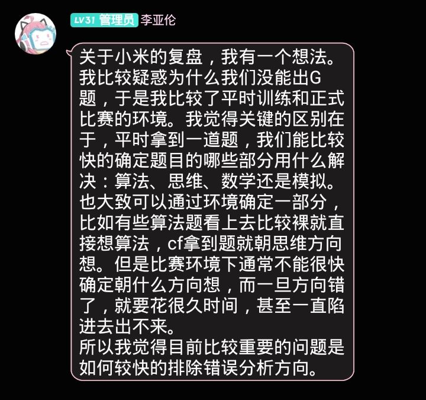

# ICPC北京小米邀请赛

## AC 2/13  目标：4/13

**赛后补题目标 ** ：

**G - Rikka with Game Theory** 状态压缩DP （已）

**I - Rikka with RCPC** 单调队列优化DP （已）

E

B

---

### RE : 

**K - Rikka with Composite Number** :  没有开longlong，（以为是dfs爆栈

---

**~~一些废话~~** ：

第一次现场赛，很有氛围（

这次的签到题都没有那么签到（ 

K之后，G I J 全是DP。

有尝试分析场上选手过题时间等 ， 比如G，三个顶俩7min出，算上找题读题，猜是规律，猜错方向了（挨打

本来在I，然后还有30min的时候看码量感觉要不换G，~~万一灵光一闪~~

最后想出来了，nb，但是没时间打了，（



---

## 需学习的知识点：

随便列一下： （寒假要学的东西真的好多

A：一般图最大匹配，带花树

C：莫比乌斯反演

----

# ~

## **K - Rikka with Composite Number** 

**题意** ：给出一个数字集合（1到9），随机从集合中取出一个数加到已有数的后面，组成合数时停止，问数字长度的期望

会使随机过程继续的数字必须满足它的前缀都是素数，这样的数非常少，直接暴力就行了


---

##**J - Rikka with Book**

**题意** ： 给出很多本书，要放在桌子上，问在使最后状态是平衡的情况下最大的奇怪值，

可以发现，假设从下到上第i本书到书桌边界距离最大，那么上面的n- i本书的整体重心一定在第i本书的左边界，而对于所有的$j \in [1, i]$，第j本书以及更往上的书的整体重心一定在第j - 1本书的右边界，状压DP


---

## G - Rikka with Game Theory 

**[G  Rikka with Game Theory](https://ac.nowcoder.com/acm/contest/9328/G) **

**题意** 无向图SG值的可能数量 节点数$1 \leq n \leq 17$

正赛的时候看最快7min出，想着算上找题和看题打代码的时间，这必是规律题（挨打

实际上是状压dp（（

**题解** 所有为 0 的点一定是原图的一个极大独立集，所有为 1 的点一定是去掉为 0 的点后的一个极大独立集， 以此类推。直接状态压缩动态规划，时间复杂度$O(3 ^ n)$ 。

代码真的好妙

**code**

```c++
#include <bits/stdc++.h>
using namespace std;

typedef long long ll;

const int maxn = 20;

int g[1 << maxn];
int w[1 << maxn];
ll dp[1 << maxn]; //注意数组范围!!!

int main() {
	ios::sync_with_stdio(0); cin.tie(0); cout.tie(0);
	int n, m;
	cin >> n >> m;
	for(int i = 0, u, v; i < m; ++ i) {
		cin >> u >> v;
		-- u, -- v;
		g[u] |= 1 << v;
		g[v] |= 1 << u;
	}
	
	for(int i = 0; i < (1 << n); ++ i) {
		for(int j = 0; j < n; ++ j) {
			if(i & (1 << j)) w[i] |= g[j];
		}
	} 
	
	dp[0] = 1;
	for(int i = 1; i < (1 << n); ++ i) {
		for(int j = i; j; j = i & (j - 1)) { //遍历可能可以转移的状态
			if(  ((w[j] & j) == 0) //最大独立集
			 	&& ((w[j] & (i ^ j)) == (i ^ j)) ) //都有边相连
					dp[i] += dp[i ^ j];
		}
	}
	
	cout << dp[(1 << n) - 1];
	return 0;
} 
```

----

## I - Rikka with RCPC

[I-Rikka with RCPC](https://ac.nowcoder.com/acm/contest/9328/I)

**题意** 有n天，一天一道题，在第一天开始之前怒气值 A 是0，在每天刚开始的时候怒气值会加上$a_i$，怒气值有一个门槛 T

有四种情况：

+ 如果$A > T$, 会受到$2A$ 的攻击，A清零
+ 如果$A <= T$，并且不答题，无事发生
+ 如果$A <= T$, 并且答题，如果前$K$ 天都没有答题，不受攻击，A清零
+ 否则，即使选择答题，（如果$A <= T$, 并且答题，如果前$K$ 天内存在答题）也会受到A的攻击，A清零

问最小受到的攻击


DP肯定是DP，问题是怎么D，当时没想明白

口胡了转移方式，说状态机模型，第一二种从前一天转移，第三种从前K天（包括$sum \le T$ 之间转移，

“如果第一种情况受到攻击了算作不答题，于是后来会到第三种情况”


但其实是不会有第一种情况的，（因为第一种情况发生的唯一好处是，积累到 K天不回答问题，帮助后面 节约代价。但是节约的代价一定小于等于 T ，而超过阈值后超出的代价一定大于 T，因此这样肯定没有 每天都回答问题赚。）所以也不存在后效性（？                   


梳理一下条件：

+ $A \leq T$ ， 不答， 无事
+ $A \le T$ ,    答， $K$  x  $\to$ A = 0
+ $A \le T$ ,    答， $K$  √  $\to$ A = 0


单调队列优化dp, dp[i] 表示第 i 天答题，能被免掉的最大的攻击，

于是只有后两种情况（

```cpp
#include <bits/stdc++.h>
using namespace std;

typedef long long ll;

const int maxn = 2e5 + 10;

ll a[maxn], sum[maxn], dp[maxn], que[maxn];
int l, r;

int main() {
	ll n, k, t;
	cin >> n >> k >> t;
	for(int i = 1; i <= n; ++ i) {
		cin >> a[i];
	}
	for(int i = 1; i <= n; ++ i) {
		sum[i] = sum[i - 1] + a[i]; 
	}

	for(int i = 1; i <= n; ++ i) {
		dp[i] = dp[i - 1];
		if(i > k) {
			while(l < r && sum[i - k - 1] - dp[i - k - 1] < sum[que[r - 1]] - dp[que[r - 1]]) -- r;
			que[r ++] = i - k - 1;
		}
		while(l < r && sum[i] - sum[que[l]] > t) ++ l;
		if(l < r) dp[i] = max(dp[i], dp[que[l]] + sum[i] - sum[que[l]]); // K
	}
	
	ll ans = 1e18;
	for(int i = 1; i <= n; ++ i) {
		if(sum[n] - sum[i] <= t) {
			ans = min(ans, sum[i] - dp[i]);
		}
	}
	
	cout << ans ;
	
	return 0;
}
```

