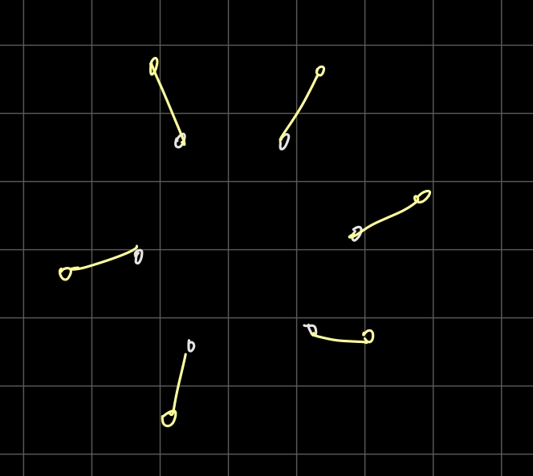
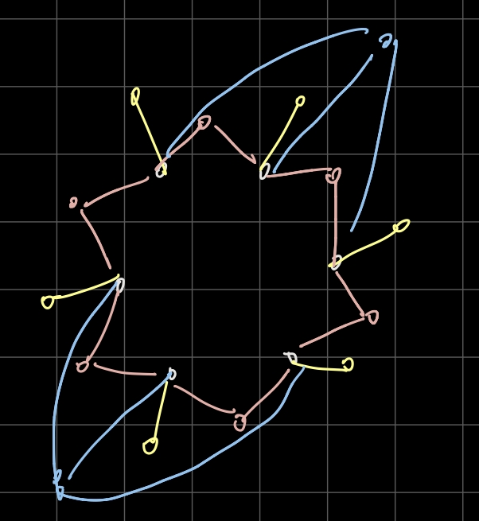
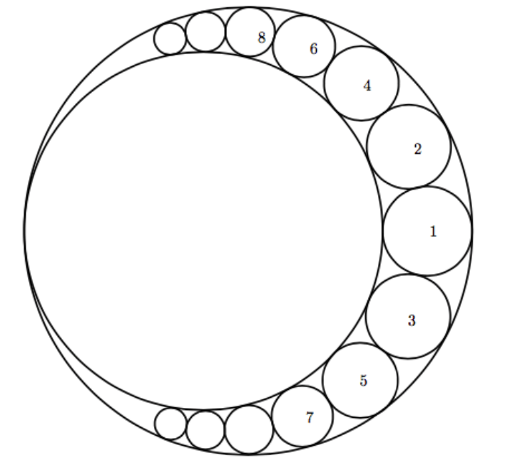
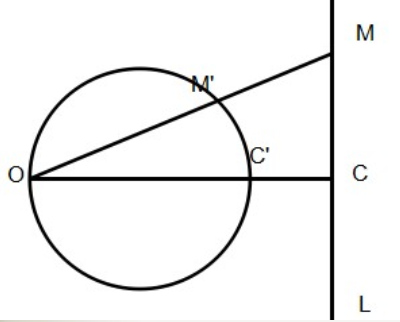
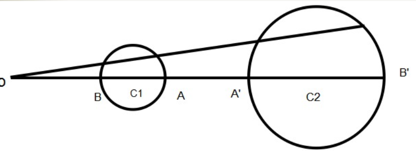
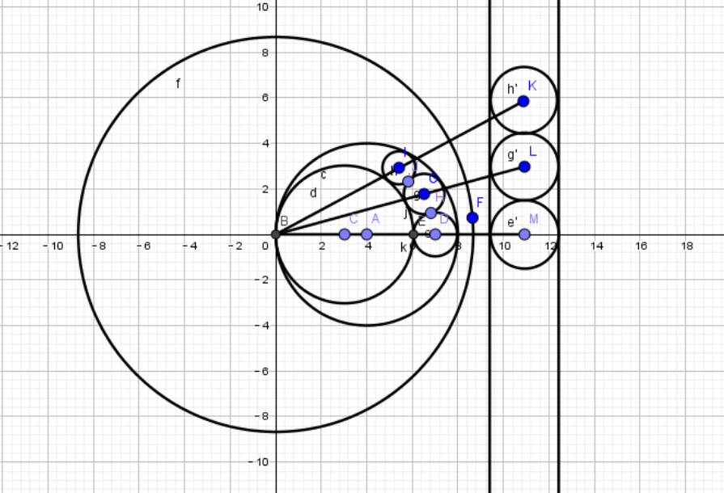

# ccpc网络赛选拔赛Round1（2017）

## AC 5/11   目标：6/11

**赛后补题目标 ：I -THe Designer（hdu6158）**

笛卡尔定理+韦达定理 （已）

圆的反演的解法（已）

### WA：1

G ：直接用自带的pow函数出现了精度问题

### OTE：1

I ：没有去掉debug的输出

### TLE: 4

I ：//

I ：//

I ：答案要求的精度只有$10^{-5}$，当圆的半径小于一定值时就可以退出，半径限定为$10^{-7}$

I ：nan是因为第二个圆的两种情况是相等的，所以两个相同根，$b^2-4ac==0$，然后因为精度问题减出一个很小很小的负数，然后开根号就错了

## 需学习的知识点：

**数位dp** （G） acwing处

**笛卡尔定理** （I）已附论文，公式见该题处

**圆的反演** （I）见该题处

---

# ~

## C - Friend-Gragh hdu6152

**题意** ：给出队伍中任意两个人之间是不是朋友，如果有任意三个人互相不是朋友或者是朋友，则队伍为$bad team$，否则为$great team$

**思路** ：直接暴力枚举三个人判断是否符合条件，符合就跳出，最坏情况复杂度为$O(n^3)$，但实际远没有这么高的复杂度，不会$T$

```c++
#include <bits/stdc++.h>
using namespace std;
bool g[3005][3005];
int main() {
    ios::sync_with_stdio(0), cin.tie(0), cout.tie(0);
    int t;
    cin >> t;
    while (t--) {
        int n;
        cin >> n;
        memset(g, 0, sizeof g);
        for (int i = 1; i <= n; i++) {
            for (int j = i + 1; j <= n; j++) {
                int a;
                cin >> a;
                if (a) {
                    g[i][j] = g[j][i] = 1;
                }
            }
        }
        bool f = 1;
        for (int i = 1; i <= n && f; i++) {
            for (int j = i + 1; j <= n && f; j++) {
                for (int k = j + 1; k <= n && f; k++) {
                    if (g[i][j] == 1 && g[j][k] == 1 && g[i][k] == 1 ||
                        g[i][j] == 0 && g[j][k] == 0 && g[i][k] == 0) {
                        f = 0;
                    }
                }
            }
        }
        if (f) {
            cout << "Great Team!" << endl;
        } else {
            cout << "Bad Team!" << endl;
        }
    }
}

```

---

## E - CaoHaha's staff hdu6154

**题意** ：能在坐标轴上画长度为1或长度为$\sqrt{2}$的线（格子的边或者对角线），问要围出面积至少为n的图形至少需要几条线。

**思路** ： 线的数目是4的倍数的时候，作斜边围成正方形，每次加面积的时候删两条斜线换成两条横的和竖的。

```c++
#include <bits/stdc++.h>
using namespace std;
int main() {
    ios::sync_with_stdio(0), cin.tie(0), cout.tie(0);
    int t;
    cin >> t;
    while (t--) {
        int n;
        cin >> n;
        int d = sqrt(double(n / 2));
        while (2 * d * d < n) d++;
        int ans = d * 4;
        int s = 2 * d * d;
        if (s - d - 1 >= n) {
            ans -= 1;
            s -= d + 1;
            if (s - d + 1 >= n) {
                ans--;
                s -= d - 1;
                if (s - d >= n) {
                    ans--;
                }
            }
        }
        cout << ans << endl;
    }
}

```

---

## D - A Secret hdu6153

**题意** ：给出两个字符串，将第二个字符串的每一个后缀在第一个字符串里出现的个数分别记作$N_i$，对应的每个后缀的长度记作$L_i$，求$\sum_{i = 1}^{len(s2)}{N_i * L_i}$， 对$1e9 + 7$取模

即 : 模式串后缀在目标串中的出现次数

**思路** : 反转字符串将后缀转化为前缀，KMP，因为next数组本身记录的就是相同子串的长度，因此可以在每个循环内部对匹配过的字符的下标进行计数

[一个链接](https://www.cnblogs.com/Egoist-/p/7435573.html)

```c++
#include <bits/stdc++.h>
using namespace std;
typedef long long ll;
const ll mod = 1e9 + 7;
struct KMP {
    static const int MAXN = 1000010;
    char T[MAXN], P[MAXN];
    int fail[MAXN];
    vector<int> ans;

    void init() { ans.clear(); }

    void get_fail() {
        int m = strlen(P);
        fail[0] = fail[1] = 0;
        for (int i = 1; i < m; i++) {
            int j = fail[i];
            while (j && P[i] != P[j]) j = fail[j];
            fail[i + 1] = (P[i] == P[j] ? j + 1 : 0);
        }
    }

    void find() {
        int n = strlen(T), m = strlen(P);
        get_fail();
        int j = 0;
        for (int i = 0; i < n; i++) {
            while (j && P[j] != T[i]) j = fail[j];
            if (P[j] == T[i]) j++;
            ans.push_back(j);
        }
    }
} kmp;  // P为模式串，下标从0开始，输入后直接调用find()

ll cnt[2000000];

int main() {
    ios::sync_with_stdio(0), cin.tie(0), cout.tie(0);
    int t;
    cin >> t;
    while (t--) {
        kmp.init();
        cin >> kmp.T >> kmp.P;
        int n = strlen(kmp.T);
        int m = strlen(kmp.P);
        for (int i = 0; i <= max(n, m); i++) cnt[i] = i;
        reverse(kmp.T, kmp.T + n);
        reverse(kmp.P, kmp.P + m);
        kmp.find();
        for (int i = 1; i <= m; i++) {
            cnt[i] = (cnt[i] + cnt[kmp.fail[i]]) % mod;
        }
        ll ans = 0;
        for (auto x : kmp.ans) {
            ans = (ans + cnt[x]) % mod;
        }
        cout << ans << endl;
    }
}
```

---

## A - Vertex Cover hdu6150

**题意** ：定义最小定点覆盖是最小数目的定点集合，满足集合内的定点的所有直接相连的点刚好是整个图的所有边，给了一个错误的贪心代码，代码思路是每次找最大度数的点加入到集合，且如果多个点度数相同则取序号大的，取点后更新剩余点的度数（已被覆盖的边的另一个顶点度数减一），求一个构造样例，使该代码的答案数量是正解的三倍以上。

**思路** ：先取n个点标号1~n，使正解恰好是这n个点，加点使贪心代码会取正解以外的点。

每轮加点使加的点的度数和正解的点的度数一致，但由于后面加的点的序号大，贪心代码会取后面的。



例如白色是正解的点，第一轮构造黄色的点，现在每个点的度数都为1，但是黄色点的序号更大。



用同样的思路构造第二轮（粉色），第三轮（蓝色）


第k轮构造的点的个数为$\frac{n}{k}$ 下取整

点的个数一共为$\frac{n}{1} + \frac{n}{2} + \frac{n}{3} + \dots + \frac{n}{k}$

取n为100，当个数大于300时跳出

**code** ：

```c++
#include<bits/stdc++.h>
using namespace std;
int main(){
	int n=100,m=0;
	int cnt=101;
	for(int k=1;k<=n;k++){
		int p=k;
		for(int i=1;i<=n&&p<=n;i++){
			m++;
			if(i==p)p+=k,cnt++;
			if(cnt==411)break;
		}
		if(cnt==411)break;
	}
	printf("410 %d\n",m);
	n=100;
	cnt=101;
	for(int k=1;k<=n;k++){
		int p=k;
		for(int i=1;i<=n&&p<=n;i++){
			printf("%d %d\n",i,cnt);
			if(i==p)p+=k,cnt++;
			if(cnt==411)break;
		}
		if(cnt==411)break;
	}
	printf("100\n");
	for(int i=1;i<=n;i++)printf("%d\n",i);
	return 0;
} 
```

---

## G - Palindrome Function hdu6156

**题意** ：
$$
定义 f(n,k) = \begin{cases}
k, &\text{如果n在k进制下是回文}\\
1, &\text{如果n在k进制下不是回文}
\end{cases}

求\sum_{i = L}^{R}\sum_{j = l}^{r}{f(i,j)}
$$
**思路** ：

数位dp， 因为进制很小（2~36）, 对于每个进制分开求

**注意** ：别用自带的pow， 容易出精度问题还半天看不出来，还是自己写快速幂比较稳 ...！

**code** :

```c++
#include <bits/stdc++.h>
using namespace std;
typedef long long ll;
int dig[1000], len;

ll qpow(ll a, ll b) {
    ll ans = 1;
    while (b) {
        if (b & 1) ans *= a;
        a *= a;
        b >>= 1;
    }
    return ans;
}

ll cal(int k) {
    if (len == 0) {
        return 1;
    }
    ll ans = 1;
    for (int i = 1; i < len; i++) {
        ans += qpow(k, (i + 1) / 2);
        ans -= qpow(k, (i + 1) / 2 - 1);
    }

    bool f = 0;
    for (int i = 0; i <= (len - 1) / 2; i++) {
        if (dig[i] != dig[len - i - 1]) {
            if (dig[i] > dig[len - i - 1])
                f = 1;
            else
                f = 0;
        }
        if (i == 0) {
            ans += (dig[i] - 1) * qpow(k, (len + 1) / 2 - i - 1);
        } else {
            ans += (dig[i]) * qpow(k, (len + 1) / 2 - i - 1);
        }
    }
    if (!f) ans++;
    return ans;
}

int main() {
    // ios::sync_with_stdio(0), cin.tie(0), cout.tie(0);

    /* cin >> len;
     for (int i = 0; i < len; i++) cin >> dig[i];
     int jin;
     cin >> jin;
     cout << cal(jin);*/
    int t;
    cin >> t;
    for (int ca = 1; ca <= t; ca++) {
        int a, b, c, d;
        cin >> a >> b >> c >> d;
        ll ans = 0;
        for (int i = c; i <= d; i++) {
            ll tem = 0;
            int aa = b, bb = a;
            bb--;
            vector<int> v;
            while (aa) {
                v.push_back(aa % i);
                aa /= i;
            }
            len = v.size();
            for (int i = 0; i < len; i++) {
                dig[i] = v[len - i - 1];
            }
            v.clear();
            tem += cal(i);
            while (bb) {
                v.push_back(bb % i);
                bb /= i;
            }
            len = v.size();
            for (int i = 0; i < len; i++) {
                dig[i] = v[len - i - 1];
            }
            tem -= cal(i);
            ans += tem * i + (b - a + 1 - tem);
        }
        cout << "Case #" << ca << ": ";
        cout << ans << endl;
    }
}

```

---

## I - THe Designer hdu6158

**题意** ：给出大圆的半径和小圆的半径，按图示顺序和方法画n个圆，求这n个圆的面积，数据范围：$1\leq n \leq 10^7,1\leq T \leq 1200$



多圆相切相关

**笛卡尔定理**   [百度百科]([https://baike.baidu.com/item/%E7%AC%9B%E5%8D%A1%E5%B0%94%E5%AE%9A%E7%90%86/20406483?fr=aladdin](https://baike.baidu.com/item/笛卡尔定理/20406483?fr=aladdin))

若平面上四个半径为r1、r2、r3、r4的圆两两相切于不同点，则其半径满足以下结论：

+ 若四圆两两外切，则$(\sum_{i = 1}^{4}{\frac{1}{r_i}})^2 = 2 \sum_{i = 1}^{4}{\frac{1}{r_i^2}}$
+ 若半径为r1、r2、r3的圆内切于半径为r4的圆中，则$(\frac{1}{r_1} + \frac{1}{r_2} +\frac{1}{r_3} - \frac{1}{r_4})^2 = 2 \sum_{i = 1}^{4}{\frac{1}{r_i^2}}$


**推导见论文** 《笛卡尔定理与一类多圆相切问题》（同目录下pdf）


设：大圆半径R， 小圆半径r，要画的第 i 个圆的半径 $r_i$

推出 ： $(\frac{1}{r_{k + 1}}-\frac{1}{r_{k}}) - (\frac{1}{r_{k}} - \frac{1}{r_{k - 1}}) = 2 * (\frac{1}{r} - \frac{1}{R})$

~~然后不会了~~


于是拿公式硬做：**TLE**

```c++
#include <bits/stdc++.h>
using namespace std;

const double pi = atan(1) * 4;

double r[1000005];

int main() {
    ios::sync_with_stdio(0);
    int t;
    cin >> t;
    while (t--) {
        double r1, r2, n;
        cin >> r1 >> r2 >> n;
        if (r1 < r2) swap(r1, r2);
        r[1] = 1 / (r1 - r2);
        r1 = 1 / r1;
        r2 = 1 / r2;
        for (int i = 2; i <= n / 2 + 1; i++) {
            double b = (r2 + r[i - 1] - r1);
            r[i] =
                (2 * b + sqrt(4 * b * b + 4 * (b * b - 2 * r2 * r2 - r1 * r1 -
                                               2 * r[i - 1] * r[i - 1]))) /
                2;
        }
        double ans = 1 / r[1];
        for (int i = 2; i <= n; i++) {
            ans += 1 / r[i / 2 + 1] / r[i / 2 + 1];
        }
        ans *= pi;
        cout << fixed << setprecision(5) << ans << endl;
    }
}
```

**TLE**，debug出现nan（not a number），百度nan常见原因 [这里](https://zhidao.baidu.com/question/647260363546383925.html)

“nan一般是因为对浮点数进行了未定义的操作，比如除0、对-1开方”

+ 后来发现nan是因为第二个圆的两种情况是相等的，所以两个相同根，b^2-4ac==0，然后因为精度问题减出一个很小很小的负数，然后开根号就错了

代码有很多的倒数和开方什么的，有较大的精度误差


[笛卡尔定理+韦达定理 题解](https://blog.csdn.net/so_so_y/article/details/77460756)

$(\frac{1}{r_1} + \frac{1}{r_2} +\frac{1}{r_3} - \frac{1}{r_4})^2 = 2 \sum_{i = 1}^{4}{\frac{1}{r_i^2}}$

仅$r_3$ 未知

展开，得 $-\frac{1}{r_3^2} + 2(\frac{1}{r_1} + \frac{1}{r_2} - \frac{1}{r_4 })\frac{1}{r_3}+(\frac{1}{r_1} + \frac{1}{r_2} - \frac{1}{r_4})^2-2(\frac{1}{r_1^2}+\frac{1}{r_2^2}+\frac{1}{r_3^2}+\frac{1}{r_4^2})=0$

$x_1 + x_2 = 2(\frac{1}{r_1} + \frac{1}{r_2} - \frac{1}{r_4 })$

递推

**优化** ：答案要求的精度只有$10^{-5}$，当圆的半径小于一定值时就可以退出，半径限定为$10^{-7}$

**用倒数做，能少除几次就少除几次**

~~要被精度逼疯了~~

```c++
#include <bits/stdc++.h>
using namespace std;

#define pi acos(-1.0)
#define eps 1e-7

int main(){
    int T, n;
    scanf("%d", &T);
    while(T --){
        double r4, r1, y4, y1, y2, y3, tmp, ans = 0.0;
        scanf("%lf%lf%d", &r4, &r1, &n);
        if(r4 < r1) swap(r4, r1);
        y4 = -1.0 / r4, y1 = 1.0 / r1, y2 = 1.0 / (r4 - r1);
        ans += (r4 - r1) * (r4 - r1);
        y3 = y4 + y1 + y2;
        for(int i = 1;i < n;i++)
        {
            ans += ( 1.0 / y3) * (1.0 / y3);
            if(1.0 / y3 < eps) break;
            if(i + 1 < n) ans += (1.0 / y3) * (1.0 / y3), i ++;
            tmp = 2 * (y4 + y1 + y3) - y2;
            y2 = y3;
            y3 = tmp;
        }
        ans *= pi;
        printf("%.5lf\n", ans);
    }
    
    return 0;
}
```


[圆的反演  题解](https://www.cnblogs.com/NineSwords/p/9225187.html)  $\color{blue}{该链接还包含圆的反演练习题}$

**圆的反演** ：已知一圆C，圆心为O，半径为r，如果P与P’在过圆心O的直线上，且$OP * OP' = r ^2$则称P与P'关于O互为反演点。

**几条性质** ：

+ 过反演中心的圆，反形(经过反演之后的图形)为不过反演中心的直线。
+ 不过反演中心的直线，反形为过反演中心的圆。




+ 不过反演中心的圆，反形也为不过反演中心的圆，并且反演中心为这两个互为反形的圆的位似中心。




可推出：

+ 相切两圆的反象仍相切，若切点恰是反演中心，则其反象为两平行线。

+ 相离的两圆反演(反演中心不在圆上)后仍然相离；两圆相切，若反演中心在某圆上，则为反形为相切的直线与圆。


于是该题：

将两个大圆的切点作为反演中心反演两个大圆成两条直线，根据反演前后相切性不变的道理，直接将两直线间夹着的那些圆反演回去求个面积就好了。




**注意** ：反演的圆心不能直接算，要用圆上的坐标去算。

```c++
#include <bits/stdc++.h>
using namespace std;
const double pi = acos(-1);

int main() {
    ios::sync_with_stdio(0), cin.tie(0), cout.tie(0);
    int t;
    cin >> t;
    while (t--) {
        double r1, r2;
        int n;
        cin >> r1 >> r2 >> n;
        if (r1 < r2) swap(r1, r2);
        double r = (1.0 / r2 - 1.0 / r1) / 4.0, ans = 0, h = 0,
               d = (1.0 / r2 + 1.0 / r1) / 4.0;
        for (int i = 1; i <= n; i++) {
            double k = sqrt(d * d + h * h);
            double g = pi * r * r / (k * k - r * r) / (k * k - r * r);
            ans += g;
            if (i & 1) h += 2.0 * r;
            if (g < 1e-12) break;
        }
        cout << fixed << setprecision(5) << ans << endl;
    }
}
```


