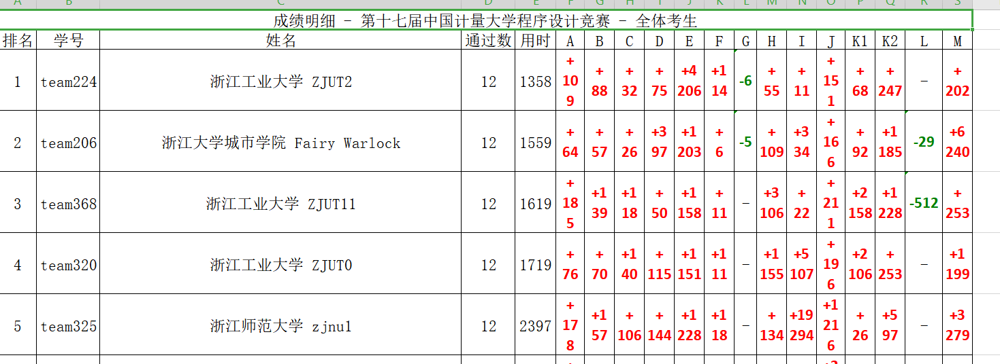
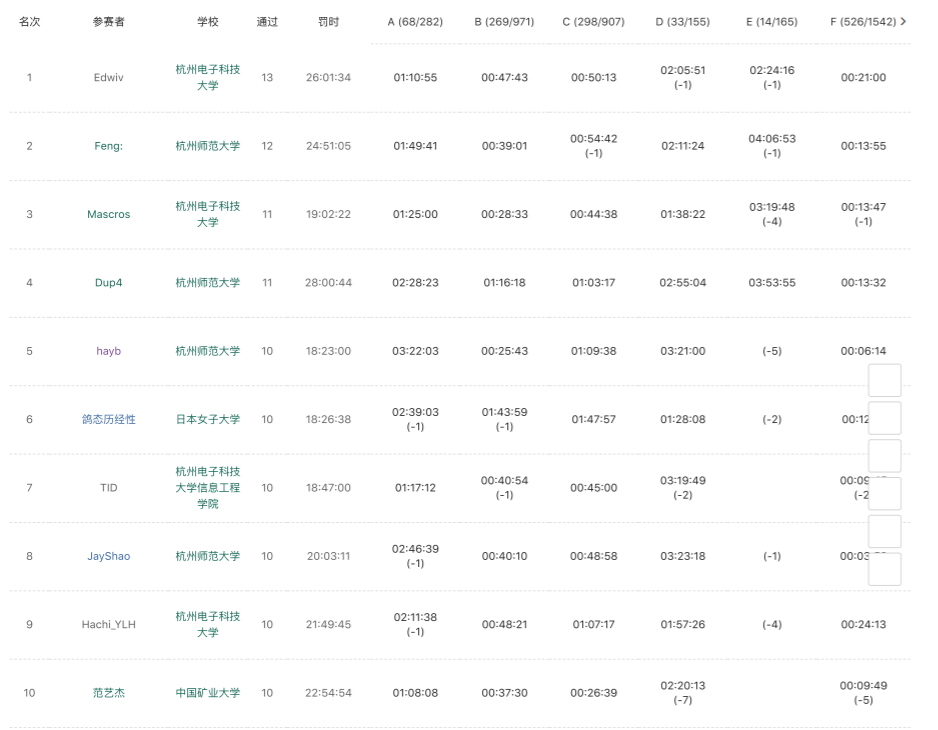
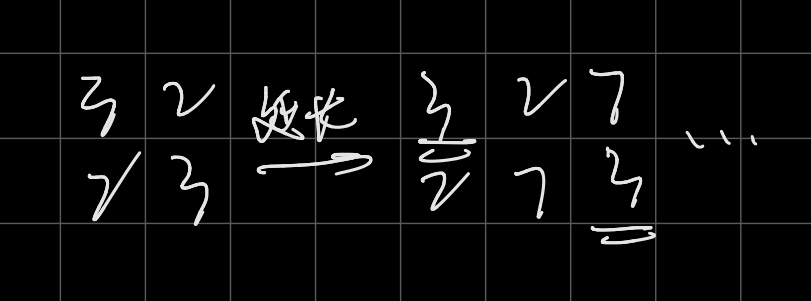

# 第十七届中国计量大学程序设计竞赛

## AC 12/14  目标：13/14

**赛后补题目标 ** ：

**G - Goddess ** （待）

### WA：6

C : 爆int了

H ：初始化写错了（？ 不过为啥不能mem

E ：~~好像是题目出锅了~~

K1 ：（*2）以为每个字符串的长度刚好是18位，**题意理解失败**

K2 ： 没有取模，~~但是纸质题面没有取模，只有电子题面上有~~

### PE ：1

B ：行末空格

### TLE : 2

H :  常数太大了，然后重写了

H ：cin改scanf冲了一发

---

pta最后的榜



牛客同步赛的4:40的榜



---

**~~一些废话~~** ：G发现似乎杭电多校的时候有原题，但是没补题，..爬了，听说当时好像难度分类还是简单（？），这就去补好吧（咕咕）

---

# ~

## F - Flag Scramble Competition

**题意** ：输出文本段中出现最多的字母（小写）

对**文本段**到底是什么有点不清楚，

```c++
#include <iostream>

using namespace std;
int cnt[4000];
int main()
{
    ios::sync_with_stdio(0),cin.tie(0),cout.tie(0);
    cout<<'e';
}

```

---

## C - Cook Steak

**题意** ：给出每个牛排的温度区间，要煎每块牛排温度必须在区间内，温度每分钟能上升或下降一度，按顺序煎牛排，问所需要的最小时间

直接模拟，每次就近到达温度上限或下限就行，

```c++
#include <iostream>
using namespace std;
typedef long long ll;

ll a[200000],b[200000];
int main()
{
    ios::sync_with_stdio(0),cin.tie(0),cout.tie(0);
    ll t;
    cin>>t;
    while(t--){
        ll n;
        cin>>n;
        for(int i=1;i<=n;i++) cin>>a[i]>>b[i];
        ll d=0;
        ll ans=0;
        for(int i=1;i<=n;i++){
            if(d>=a[i]&&d<=b[i]) continue;
            if(d>b[i]){
                ans+=d-b[i];
                d=b[i];
            }else {
                ans+=a[i]-d;
                d=a[i];
            }
        }
        cout<<(ans+n)<<endl;
    }
}
```

---

## I - Isolated Pointset

**题意** ：给出n，问是否能构造n个点，使任意两个点的中垂线上都有点，

$\geq 3$输出`yes`，

```c++
#include <iostream>
using namespace std;
typedef long long ll;

ll a[200000],b[200000];
int main()
{
    ios::sync_with_stdio(0),cin.tie(0),cout.tie(0);
    int t;
    cin>>t;
    while(t--){
        int n;
        cin>>n;
        if(n>=3) cout<<"Yes"<<endl;
        else cout<<"No"<<endl;
    }
}

```

---

## B - Broken Pad

**题意** ：有很多张牌，每次选一张牌相当于改变该张及以后所有牌的状态，每组数据两个字符串，分别表示当前状态和目标状态，点空格`0`，表示都不选，问从a到b的最小操作数

模拟，两种选法，有没有`0`，看看分别需要多少操作

```c++
#include<bits/stdc++.h>

using namespace std;
typedef long long ll;

char a[200000],b[200000];
int main()
{
    ios::sync_with_stdio(0),cin.tie(0),cout.tie(0);
    int t;
    cin>>t;
    while(t--){
        cin>>a>>b;
        int len=strlen(a);
        int cnt=0;
        cnt=1;
        vector<int> v;
        v.push_back(0);
        if(b[0]=='1'){
            cnt++;
            v.push_back(1);
        }
        for(int i=1;i<len;i++){
            if(b[i]!=b[i-1]){
                cnt++;
                v.push_back(i+1);
            }
        }
        int cnt2=0;
        for(int i=0;i<len;i++){
            if(a[i]==b[i]) b[i]='0';
            else b[i]='1';
        }
        vector<int> k;
        if(b[0]=='1'){
            cnt2++;
            k.push_back(1);
        }
        for(int i=1;i<len;i++){
            if(b[i]!=b[i-1]){
                cnt2++;
                k.push_back(i+1);
            }
        }
        if(cnt<cnt2){
            for(int i=0;i<v.size();i++){
                cout<<v[i];
                if(i!=v.size()-1) cout<<' ';
            }
        }else {
            for(int i=0;i<k.size();i++){
                cout<<k[i];
                if(i!=k.size()-1) cout<<' ';
            }
        }
        cout<<endl;
    }
}

```

---

## D -  Dessert Time

**题意** ：有n个数，保证每个数都出现多于1次，双方轮流选数，保证不能选比上一个人选的数小，如果此时没有更大的数可以选，就要把所有的数都选走，拿走最后一个数的人输，问先手是否能赢，若不能输出`-1`，否则输出第一次拿的数

排序，统计每个数出现的个数，从大到小

如果都是偶数，先手输，否则输出第一次出现奇数个数的数字本身

```c++
#include<bits/stdc++.h>

using namespace std;
typedef long long ll;

int a[400000];

bool cmp(int a,int b){
    return a>b;
}
vector<pair<int,int> > v;
int main()
{
    ios::sync_with_stdio(0),cin.tie(0),cout.tie(0);
    int t;
    cin>>t;
    while(t--){
        int n;
        cin>>n;
        for(int i=1;i<=n;i++) cin>>a[i];
        sort(a+1,a+1+n,cmp);
        a[n+1]=0;
        v.clear();
        int cnt=1;
        for(int i=2;i<=n+1;i++){
            if(a[i]!=a[i-1]){
                v.push_back(pair<int,int>(a[i-1],cnt));
                cnt=1;
            }else {
                cnt++;
            }
        }
        bool f=0;
        int p=0;
        for(int i=0;i<v.size();i++){
            if(v[i].second&1){
                f=1;
                p=i;
                break;
            }
        }
        if(!f) cout<<v.rbegin()->first<<endl;
        else {
            if(v.rbegin()->first==v[p].first) cout<<-1<<endl;
            else cout<<v[p].first<<endl;
        }
    }
}

```

---

## H - Happy Time is Always Short

**题意** :给出n个数，给出m个区间，每次把区间内的数全删掉，可能重复删，每次删掉后问剩下的数中最大的值是多少

区间修改，线段树
原先是直接区间修改区间查询，但是常数太大了，后来改了个想法，区间加单点查树状数组，再加一个指针从大到小，如果被删了树状数组的这个点就不是0，就跳到下一个点，直到删完就跳到最后，这样常数很小的

```c++
#include<bits/stdc++.h>
using namespace std;

int bit[100005];
pair<int,int> a[100005];

void padd(int k,int x){
    while(k<100005){
        bit[k]+=x;
        k+=k&-k;
    }
}

void add(int l,int r,int x){
    padd(l,x);
    padd(r+1,-x);
}

int query(int k){
    int ans=0;
    while(k){
        ans+=bit[k];
        k-=k&-k;
    }
    return ans;
}

bool cmp(pair<int,int> a,pair<int,int> b){
    return a.first>b.first;
}

int main(){
    int t;
    scanf("%d",&t);
    while(t--){
        int n,m;
        scanf("%d%d",&n,&m);
        memset(bit,0,sizeof bit);
        for(int i=1;i<=n;i++){
            scanf("%d",&a[i].first);
            a[i].second=i;
        }
        sort(a+1,a+1+n,cmp);
        int p=1;
        for(int i=1;i<=m;i++){
            int l,r;
            scanf("%d%d",&l,&r);
            add(l,r,1);
            while(p<=n&&query(a[p].second)) p++;
            if(p==n+1) printf("0\n");
            else printf("%d\n",a[p].first);
        }
    }
}

```

---

## E - Eat Grapes

**题意** ：有一串葡萄，给出葡萄主干上每颗葡萄上连的葡萄数，最后一个葡萄上有一个固有的葡萄（？）不算在连的葡萄上面

每次可以选连在最后一个节点（葡萄）上的任意数量的葡萄，直到全拿完，该节点会自动加到前一颗葡萄上，

相当于每个节点上的数加一，

从后往前找如果有一个点的葡萄数大于等于2，则说明可以转变先后手，即先到这里的人胜

~~题目好像有点问题（？~~

```c++
#include<bits/stdc++.h>
using namespace std;
typedef long long ll;

int a[100005];

int main(){
    ios::sync_with_stdio(0),cin.tie(0),cout.tie(0);
    int t;
    cin>>t;
    while(t--){
        int n;
        cin>>n;
        a[0]=1;
        for(int i=1;i<=n;i++) cin>>a[i];
        int i=n;
        for(i=n;i>=0;i--) if(a[i]) break;
        int num=n-i;
        if(num&1) cout<<"these are sour grapes"<<endl;
        else cout<<"these are sweet grapes"<<endl;
    }
    return 0;
}

```

---

## K1 - Known-Well Palindrome Date - Easy Version

**题意** ：每行是一组数据，每组数据包含若干个身份证片段，问其中有多少个连续的八位数字刚好是合法的从0001年1月1日到9999年12月31日的回文的子串，不包含空格

刚开始题目读错了以为是从身份证长度中截取本身是日期的部分判断是不是合法，是不是回文 ~~爬了~~

后来也是题意理解错，以为每个串的长度一定是刚好18位，

```c++
#include<bits/stdc++.h>
using namespace std;

int mo[100]={0,31,28,31,30,31,30,31,31,30,31,30,31};

bool run(int y){
    if(y%400==0) return 1;
    if(y%100==0) return 0;
    if(y%4==0) return 1;
    return 0;
}

int main(){
    ios::sync_with_stdio(0),cin.tie(0),cout.tie(0);
    string s;
    while(getline(cin,s)){
        if(s[0]=='#') return 0;
        int cnt=0;
        for(int i=0;i<s.length();i++){
            if(i+7>=s.length()) continue;
            bool hui=1;
            for(int j=0;j<4;j++){
                if(s[i+j]!=s[i+7-j]) hui=0;
                if(s[i]==' ') hui=0;
            }
            if(!hui) continue;
            int y,m,d;
            y=(s[i]-'0')*1000+(s[i+1]-'0')*100+(s[i+2]-'0')*10+(s[i+3]-'0');
            m=(s[i+4]-'0')*10+(s[i+5]-'0');
            d=(s[i+6]-'0')*10+(s[i+7]-'0');
            int day=mo[m];
            if(m==2&&run(y)) day++;
            bool ok=1;
            if(m==0||d==0||m>12) ok=0;
            if(d>day) ok=0;
            if(ok) cnt++;
        }
        cout<<cnt<<endl;
    }
}

```


---

## A - A Party for You Started

**题意** ：有很多领域的人来参加一个party，其中有一些领域是另一些领域的分支，（每个领域看作一个节点）给出n个点的父节点，若干次询问，`u x v`代表第u个节点来了x个人，他们想知道第v的节点有多少人，

用dfs序建图，每次加入人的时候，相当于将其所有子节点加了1，（子节点都连续）询问的时候直接输出该节点的值就行

于是就将问题转化成了区间修改单点询问

```c++
#include<bits/stdc++.h>
using namespace std;
typedef long long ll;

const ll N=30000;

ll bit[N];
ll l[N],r[N];
ll dfn[N];
vector<ll> g[N];


void padd(ll k,ll x){
    while(k<N){
        bit[k]+=x;
        k+=k&-k;
    }
}

void add(ll l,ll r,ll x){
    padd(l,x);
    padd(r+1,-x);
}

ll query(ll k){
    ll ans=0;
    while(k){
        ans+=bit[k];
        k-=k&-k;
    }
    return ans;
}

ll dfscnt=0;
void dfs(ll u ,ll fa){
    dfn[u]=++dfscnt;
    l[u]=dfscnt;
    for(auto x:g[u]){
        if(x==fa) continue;
        dfs(x,u);
    }
    r[u]=dfscnt;
}

int main(){
    ios::sync_with_stdio(0),cin.tie(0),cout.tie(0);
        ll n,m;
        cin>>n>>m;
        ll root=0;
        for(int i=1;i<=n;i++){
            ll a;
            cin>>a;
            if(a==0) root=i;
            else {
                g[a].push_back(i);
                g[i].push_back(a);
            }
        }
        dfs(root,-1);
        for(int i=1;i<=m;i++){
            ll a,b,c;
            cin>>a>>b>>c;
            cout<<query(dfn[c])<<endl;
            add(l[a],r[a],b);
        }
    }

```


---

## J - Jiufeng's Football Team

**题意** ：有很多个人，要分成两队，某些两个人之间有关系，每个关系有一个价值，对于每对有关系的两个人，如果他们要在同一队，就需要付出相应的价值，两个队伍人不一定要相同，问需要付出的最多的价值（不是和，就是最大）

二分答案，judge的时候对于每个大于mid的边，看能不能实现二分图染色

```c++
#include<bits/stdc++.h>
using namespace std;
typedef long long ll;

struct Edge{
    int v,len;
};
vector<Edge>e[20005];
int cor[20005];
bool f=1;
int mid,n,m;
void dfs(int x,int c){
    if(cor[x])return;
    cor[x]=c;
    int rc=(c==1?2:1);
    for(auto k:e[x]){
        if(k.len<=mid)continue;
        int v=k.v;
        if(c==cor[v])f=0;
        dfs(v,rc);
    }
}
bool judge(){
    f=1;
    memset(cor,0,sizeof(cor));
    for(int i=1;i<=n;i++){
        dfs(i,1);
    }
    return f;
}
int main(){
    int nn;
    scanf("%d",&nn);
    while(nn--){
        scanf("%d%d",&n,&m);
        for(int i=0;i<=n;i++)e[i].clear();
        for(int i=0;i<m;i++){
            int u,v,len;
            scanf("%d%d%d",&u,&v,&len);
            e[u].push_back((Edge){v,len});
            e[v].push_back((Edge){u,len});
        }
        int l=0,r=1e9+5;
        while(r>l){
            mid=(l+r)/2;
            if(judge())r=mid;
            else l=mid+1;
        }
        printf("%d\n",l);
    }
}

```


---

## K2 - Known-Well Palindrome Date - Hard Version

**题意** ：问从2000年1月1日到2099年12月31日之间的回文子串（不要求连续）有多少个

可以发现20--年开头定死，于是日期的yyyymmdd中的dd定死，12个月刚好12种情况，做12次dp

```c++
#include<bits/stdc++.h>
using namespace std;
typedef long long ll;
const ll mod=1e9+7;

char a[100005];
int tot=0;
string s;
char p[12][12]={
"020100102",
"020200202",
"020300302",
"020400402",
"020500502",
"020600602",
"020700702",
"020800802",
"020900902",
"020011002",
"020111102",
"020211202"};
ll dp[20];

int main(){
    ios::sync_with_stdio(0),cin.tie(0),cout.tie(0);
    while(getline(cin,s)){
        if(s[0]=='#') return 0;
        tot=0;
        for(auto x:s){
            if(x==' ') continue;
            a[++tot]=x;
        }
        ll ans =0;
        for(int i=0;i<12;i++){
            memset(dp,0,sizeof dp);
            dp[0]=1;
            for(int j=1;j<=tot;j++){
                for(int k=8;k>0;k--){
                    if(a[j]==p[i][k]) dp[k]=(dp[k-1]+dp[k])%mod;
                }
            }
            ans=(ans+dp[8])%mod;
        }
        cout<<ans<<endl;
    }
    return 0;
}

```


---

## M - Magic Cube Battle

**题意** ： 二阶魔方，问最多拧n次（$n \leq 7$）的情况下，最多最少分别有多少面是颜色相同的面

模拟，六种情况 $T \leq 35$

直接dfs $O((6^7+6^6+ \dots + 6^1) * 35)$

```c++
#include<bits/stdc++.h>

using namespace std;
typedef long long ll;

int a[24];
int b[24];

void sn(){  //shang ni
    for(int i=0;i<24;i++) b[i]=a[i];
    b[2]=a[0];
    b[3]=a[2];
    b[1]=a[3];
    b[0]=a[1];
    b[8]=a[6];
    b[9]=a[7];
    b[6]=a[4];
    b[7]=a[5];
    b[4]=a[23];
    b[5]=a[22];
    b[23]=a[8];
    b[22]=a[9];
    for(int i=0;i<24;i++) a[i]=b[i];
}

void ss(){  //shang shun
    for(int i=0;i<24;i++) b[i]=a[i];
    b[0]=a[2];
    b[2]=a[3];
    b[3]=a[1];
    b[1]=a[0];
    b[6]=a[8];
    b[7]=a[9];
    b[4]=a[6];
    b[5]=a[7];
    b[23]=a[4];
    b[22]=a[5];
    b[8]=a[23];
    b[9]=a[22];
    for(int i=0;i<24;i++) a[i]=b[i];
}

void qs(){
    for(int i=0;i<24;i++) b[i]=a[i];
    b[7]=a[6];
    b[13]=a[7];
    b[12]=a[13];
    b[6]=a[12];
    b[8]=a[2];
    b[14]=a[3];
    b[17]=a[8];
    b[16]=a[14];
    b[11]=a[17];
    b[5]=a[16];
    b[2]=a[11];
    b[3]=a[5];
    for(int i=0;i<24;i++) a[i]=b[i];
}

void qn(){
        for(int i=0;i<24;i++) b[i]=a[i];

    b[6]=a[7];
    b[7]=a[13];
    b[13]=a[12];
    b[12]=a[6];
    b[2]=a[8];
    b[3]=a[14];
    b[8]=a[17];
    b[14]=a[16];
    b[17]=a[11];
    b[16]=a[5];
    b[11]=a[2];
    b[5]=a[3];
    for(int i=0;i<24;i++) a[i]=b[i];

}

void cs(){
        for(int i=0;i<24;i++) b[i]=a[i];

    b[1]=a[7];
    b[3]=a[13];
    b[7]=a[17];
    b[13]=a[19];
    b[17]=a[21];
    b[19]=a[23];
    b[21]=a[1];
    b[23]=a[3];
    b[8]=a[14];
    b[14]=a[15];
    b[15]=a[9];
    b[9]=a[8];
    for(int i=0;i<24;i++) a[i]=b[i];
}

void cn(){
        for(int i=0;i<24;i++) b[i]=a[i];

    b[7]=a[1];
    b[13]=a[3];
    b[17]=a[7];
    b[19]=a[13];
    b[21]=a[17];
    b[23]=a[19];
    b[1]=a[21];
    b[3]=a[23];
    b[14]=a[8];
    b[15]=a[14];
    b[9]=a[15];
    b[8]=a[9];
    for(int i=0;i<24;i++) a[i]=b[i];
}


int shu(){
    int cnt=0;
    if(a[6]==a[7]&&a[7]==a[13]&&a[13]==a[12]) cnt++;
    if(a[0]==a[1]&&a[1]==a[3]&&a[3]==a[2]) cnt++;
    if(a[8]==a[9]&&a[9]==a[15]&&a[15]==a[14]) cnt++;
    if(a[4]==a[5]&&a[5]==a[11]&&a[11]==a[10]) cnt++;
    if(a[16]==a[17]&&a[17]==a[19]&&a[19]==a[18]) cnt++;
    if(a[20]==a[21]&&a[21]==a[23]&&a[23]==a[22]) cnt++;
    return cnt;
}
int mmax=0,mmin=6;

void dfs(int d){
        int cnt=shu();
        mmax=max(cnt,mmax);
        mmin=min(mmin,cnt);
    if(d==0){
        return;
    }
    qs();
    dfs(d-1);
    qn();
    qn();
    dfs(d-1);
    qs();
    sn();
    dfs(d-1);
    ss();
    ss();
    dfs(d-1);
    sn();
    cn();
    dfs(d-1);
    cs();
    cs();
    dfs(d-1);
    cn();
}

int main()
{
    ios::sync_with_stdio(0),cin.tie(0),cout.tie(0);
    int t;
    cin>>t;
    while(t--){
        int n;
        cin>>n;
        mmax=0,mmin=6;
        for(int i=0;i<24;i++) cin>>a[i];
        dfs(n);
        cout<<mmax<<' '<<mmin<<endl;
    }
}

```

---

## G - Goddess

**题意** ：有n个点，m条边，涂色，颜色编号从0开始，两种操作，`1 u x`，将u点涂成x色，`2 u`重涂u点，要求重涂的颜色与相邻点的颜色都不相同并且颜色编号最小（mex）,

杭电多校有一道题，

分块做，

[杭电多校mex题解](https://www.cnblogs.com/dysyn1314/p/13357864.html)


---

## L - Link Game of Prime Factors

**题意** ： 用连连看规则，但每次消去是消最大公约数，当当前格的数变为0或1时，该格子消失，给出n*m的矩阵问能不能消完

10*10的大小，一个点20组数据

~~题外话~~ ：最后40min真的没思路，筛掉一些必no的情况之后拿随机数乱冲了512发，（真就刚好512

必no的情况：每个数质因数分解，若有某个质因数出现的次数为奇数次，必no

若有某个数带有的某个质因数的个数比该质数的总数的一半多，必no

还有就是十字交叉但别的地方没有该质数，一直约不到的情况，但没有判这个，因为好像可以一直延长下去（..



另外还有一些情况，优先最近距离也不行，

而且觉得可能能套娃，完全动不了，

总之把想的贪心啥的全否了..