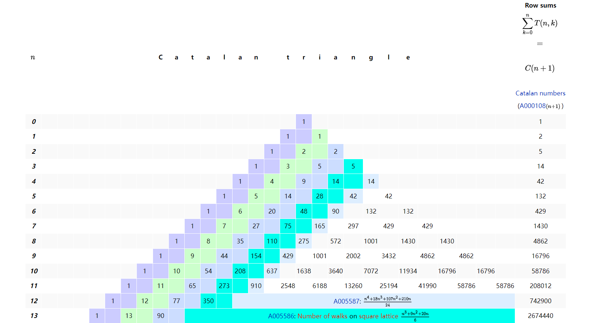

卡特兰三角

**卡特兰数**：由n个X和n个Y组成的一个序列中，满足**所有前缀中Y出现的次数不超过X出现的次数**的序列的个数

$C_n = \frac{1}{n + 1} (^{2n}_{n})$

**卡特兰三角**：由n个X和k个Y组成的一个序列，满足**所有前缀中Y出现的次数-X出现的次数小于m**的序列的个数
$$
C_m(n ,k) = \begin{cases} (^{n + k}_{k}), \, 0 \le k < m \\
(^{n + k}_{k}) - (^{n + k} _{k - m}), \, m \le k \le n +m -1 \\
0 ,\, k > n +m -1
\end{cases}
$$

---

卡特兰三角（OEIS）：$T(n, k) = T(n -1, k) + T(n,k - 1)$

$T(n + 1, n + 1) = \sum_{k = 0}^{n} T(n, k)$

