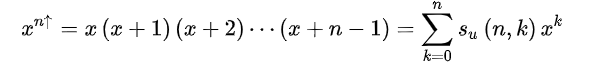
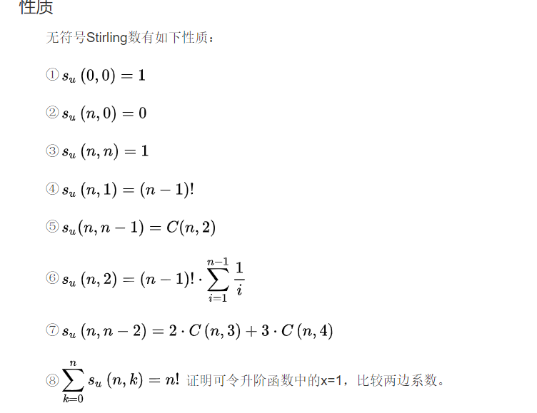
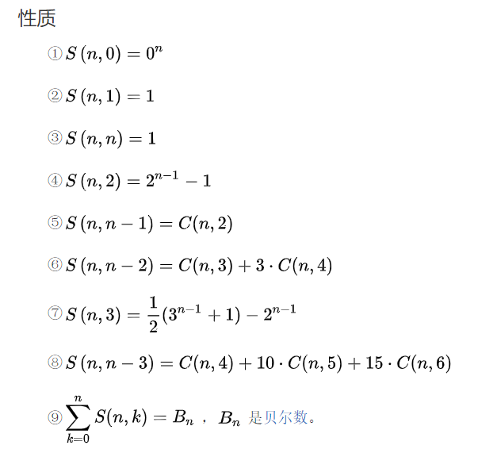
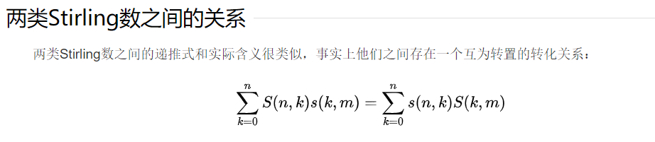

# 斯特林数

[百度百科讲的超好](https://baike.baidu.com/item/%E6%96%AF%E7%89%B9%E6%9E%97%E6%95%B0/4938529?fr=aladdin)

## 第一类斯特林数（无符号第一类）

定义：$[^n_k]$ 表示将n个两两不同的元素，划分为k个非空圆排列的方案数。

递推式 $[^k_n] = [^{n - 1}_{k - 1}] + (n - 1)[^{n - 1}_k]$

升阶函数

（每一项系数则为无符号第一类斯特林数，求前n项和则为取x=1

## 第二类斯特林数

定义：$\{^n_k\}$ 表示将n个两两不同的元素，划分为k个非空子集的方案数。

递推式$\{^n_k\} = \{^{n - 1}_{k - 1}\} + k \{^{n - 1}_k\}$

